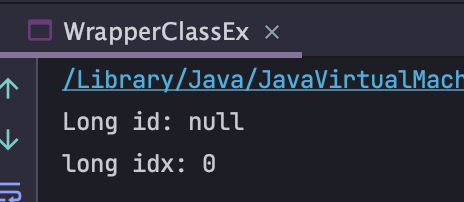
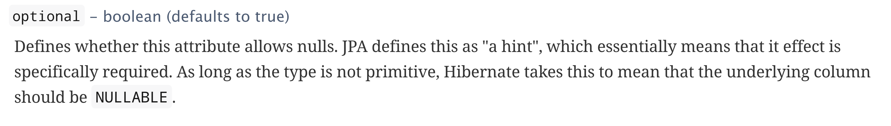

## 왜 JPA column에 wrapperClass를 사용할까?


여러분들은 궁금하지 않았나요??  
근데 자바의 굉장히 본질적인 측면에서 답을 얻을 수 있었습니다.  

```java
public class WrapperClassEx {
    Long id;
    long idx;

    public static void main(String[] args) {
        WrapperClassEx wrapperClassEx = new WrapperClassEx();
        System.out.println("Long id: " + wrapperClassEx.id + "\nlong idx: " + wrapperClassEx.idx);
    }
}
```



자 이렇게 Long으로 선언된 id 는 아무것도 대입해주지 않았을때 null을 반환하지만, long은 0을 반환합니다.  
여기서 알 수 있죠 DB를 조회했을때 해당 column이 primitive type 이라면 값이 0일때 null이여서 0인지 값이 실제로 0인지 구별할 수 없게 됩니다.

#### Hibernate 공식문서에서도 권장사항을 확인할 수 있습니다.


> 이처럼 기본열이 Nullable 해야함을 요구하고 있습니다.