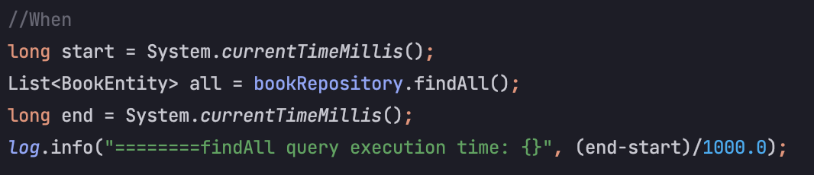
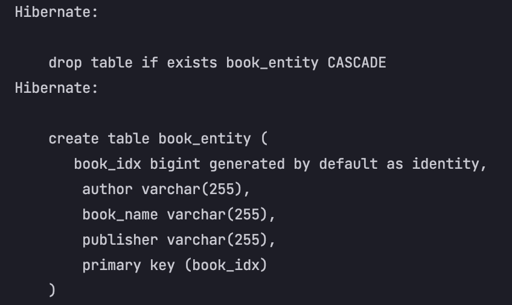

## spring.jpa.hibernate.ddl-auto 의 치명적 결함
> 이 문서에는 내가 직접 겪은 내용을 간단히 정리할 것이다.

간단하게 3만건 insert 후 findAll JPA method를 실행했을 때 3만건이 조회되는지 확인하는 `@Test` 였다.

기존에는 `spring.jpa.hibernate.ddl-auto: create` 를 사용하고 있었다.  
하지만 아래와 같은 검증 코드에서 3만건이 아닌 12만건을 조회하는 결과를 초래하더라..

query를 확인하니 초반에 create 속성의 기능인 drop query를 안날리는 것을 발견했다!!  
원래는 아래와 같이(해결된 쿼리) drop 날라간후에 create 되면서 기존 data를 다 밀어줘야 함.

암튼... 구글링을 엄청 해본 결과 답을 얻을 수 있었다.  
그건 바로 `hibernate.hbm2ddl.auto` 라는 속성이다.  
이 속성을 설명하자면! `spring.jpa.hibernate.ddl-auto` 프로퍼티 또한 `hibernate.hbm2ddl.auto`라는 속성으로 결국 hibernate에 전달 될 값을 지정하는 기능을 한다.

결론적으로 둘 중 어떤걸 사용해야 하는가에 대한 레퍼런스는 찾을 수 없었다.  
나 처럼 drop 이 안되고 계속 create 만 하는 오류를 범하게 된다면 해당 옵션으로 대응하길 바란다.