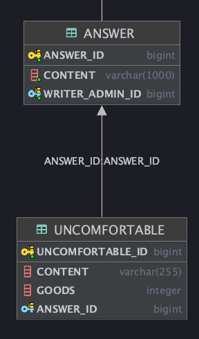

# JPA 쿼리 성능 개선 사례

## 연관된 Entity의 save를 위해서는 반대편 Entity ID만 있으면 된다.


1번 예제는 위와 같은 엔티티를 이용해 차이를 확인해 볼게요!  
주문(OrderEntity)에서 매번 회원을 조회할 필요가 없을 때, 주문은 회원의 모든 정보(MemberEntity)를 알 필요가 없습니다. 주문은 `회원Id` 만을 갖고 있으면 됩니다.

### `회원Id`만을 멤버로 갖는 생성자 만들기

```java
public Member(String id) {
    this.id = id;
}
```

### 주문을 insert 할 때 `회원Id` 만을 연관관계로 갖고 있으면 됩니다.

```java
Order.builder()
        .id(null)
        .book(bookEntity)
        .member(new Member(memberEntity.getId()))
        .build();
```

## Cross Join은 카테시안 곱을 일으킨다.

불편함과 답변의 사이의 ERD가 아래와 같을 때.

<p align="center">
    
</p>

Querydsl 쿼리 메소드를 아래와 같이 작성하면..

```java
public AnswerDomain findByUncomfortableIdx(long uncomfortableIdx) {
    return queryFactory
            .selectFrom(QAnswerDomain.answerDomain)
            .where(QAnswerDomain.answerDomain.uncomfortableDomain.uncomfortableIdx.eq(uncomfortableIdx))
            .fetchOne();
}
```
Feature:: 불편함과 답변을 한번에 조회한다.

1. answerDomain 엔티티의 전부를 조회한다. 
2. 답변과 연관된 불편함이 내가 조회하고자 하는 불편함과 일치해야 한다.


### Hibernate 자동 쿼리
```sql
Hibernate: 
    select
        answerdoma0_.answer_id as answer_i1_1_,
        answerdoma0_.writer_admin_id as writer_a3_1_,
        answerdoma0_.content as content2_1_ 
    from
        answer answerdoma0_ cross 
    join
        uncomfortable uncomforta1_ 
    where
        answerdoma0_.answer_id=uncomforta1_.answer_id 
        and uncomforta1_.uncomfortable_id=?
```

* `cross join` 발생하여 join 조건을 무시하고 `answer` 테이블에 해당하는 모든 칼럼이 `uncomfortable` 테이블의 모든 행들과 조인되는 경우가 발생한다.
* 