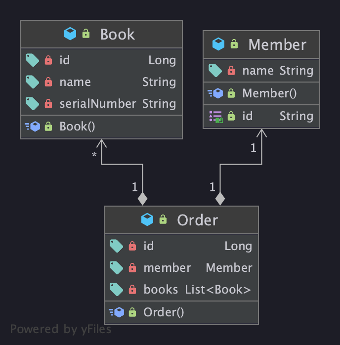

# JPA 쿼리 성능 개선 사례

## 1. 연관된 Entity의 save를 위해서는 반대편 Entity ID만 있으면 된다.

우리 서비스는 위와 같은 엔티티, 연관관계를 가집니다.  
주문(OrderEntity)에서 매번 회원을 조회할 필요가 없을 때, 주문은 회원의 모든 정보(MemberEntity)를 알 필요가 없습니다. 주문은 `회원Id` 만을 갖고 있으면 됩니다.

