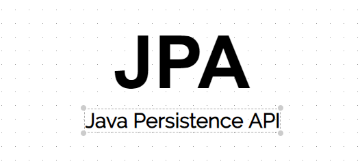

# 나는 jpa를 왜 쓰고 jpql을 왜 싫어하며 querydsl을 왜 사랑할까.

이 글을 정확한 정보로 근거있게 쓰기 위해서 JPA 기본편부터 ㅋㅋㅋ다시 훑고 다양한 사람들의 견해에 대해 듣고 왔다.  
요즘 기선님 강의, 유튜브 굉장히 잘 보고 있는데 기선님이 강조하시는게 **"그 기술이 어떤 문제를 해결하고자 하는지 그 기술이 난 왜 필요한지 알아야 한다."** 이다.  

저것만 들어서는 감이 잘 안올거다 오히려 반발심이 들 수도 있다.  
그냥 "요즘 기업들에게 많이 쓰는데 트랜디한 그 이유가 있는거 아니야?" 라고만 생각하고 끝날 수도 있다. (물론 나도 처음에 그랬다.)  
(근데 한번쯤은 진짜 진지하게 개발자로써 생각해보면 좋을 것 같다.)

이참에 JPA가 필요한 나만의 이유를 들어 정리해보려고 한다.  

## JPA

JPA는 DataJPA, JPQL, Querydsl의 기능을 포함하고 있는 Java ORM 기술의 대표적인 주자라고 생각하면 좋다.  
JPA를 비교할 때 Mybatis, Ibatis를 많이 비교하신다. 그 이유는 보통 레거시가 Mybatis고 JPA라는 기술을 새로 도입하기 위한 시점의 회사들이 많기에 그런 것 같다.  

Mybatis와 JPA의 기능은 약간 다르다. 뭔가 구글링을 해보면 "음 Mybatis의 구린 부분을 보완한 새로운 ORM 기술인가 보다." 하고 넘긴다. (나도 그랬다.)  
두 기술이 해결 하고자 하는 궁극적인 문제의 공톰점이 있지만. 여기에는 명확한 차이점도 존재한다. 그렇기에 기능의 차이도 약간 있다.

### 그냥 JDBC를 이용해서 직접 개발할 때의 문제점, 어려움을 개선하려 한다. - 공통점

* 개발자가 반복적으로 작성해야 할 코드가 많고, 서비스 로직 코드와 쿼리를 분리하기가 어렵다.
* DB 커넥션 풀의 설정 등 개발자가 DB관점에서 신경 써야 할 부분이 많아 어려움이 있다. 
* SQL 지옥에서 해어나올 수 없다. (무한 반복, 지루한 코드)
* 객체를 관계형 DB에 넣으려고 하니깐 패러다임의 불일치가 발생한다.

**-> 이렇게 되다 보면 백엔드 개발자의 업무가 SQL 매퍼의 일과 유사해진다.**

### Mybatis와 JPA의 차이점

* Mybatis는 매핑만 도와줄 뿐 sql을 작성 해야한다. JPA는 Sql을 개발자가 직접 쓸 일이 없다.
* 데이터베이스 설정 변경 시 수정할 부분이 너무 많다. JPA는 옵션들이 상황에 맞게 알아서 해준다.

