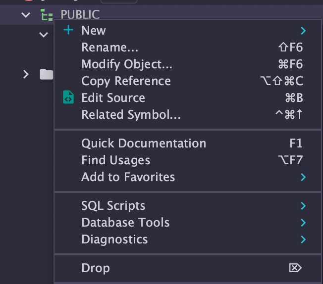
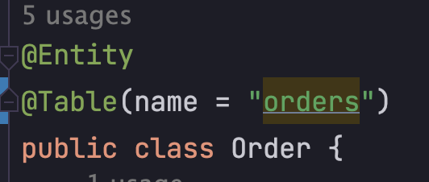

# 알고나면 화가나는 JPA 오류 유형들

```
org.hibernate.tool.schema.internal.ExceptionHandlerLoggedImpl handleException WARN: GenerationTarget encountered exception accepting command : Error executing DDL " drop table Order if exists" via JDBC Statement
```

## Auto DDL 말고 수동으로 DDL 해주자.


### 해결방안
1. 기존에 있던 TABLE 들을 모두 날려주고(DROP) 실행해 본다.
2. [H2 데이터베이스 버전 확인하기.](https://inf.run/4uLo)
3. [데이터베이스 예약어랑 테이블, 칼럼 이름이랑 겹치는지 확인한다.](https://bit.ly/3telu1m)

나는 이 글을 작성하는 이 시점에 3번째 해결방안을 검토해서 해결했다.  
난 테이블 이름이 `Order` 여서.. `@Table` 애노테이션에 name 옵션을 줘서 해결했다.
