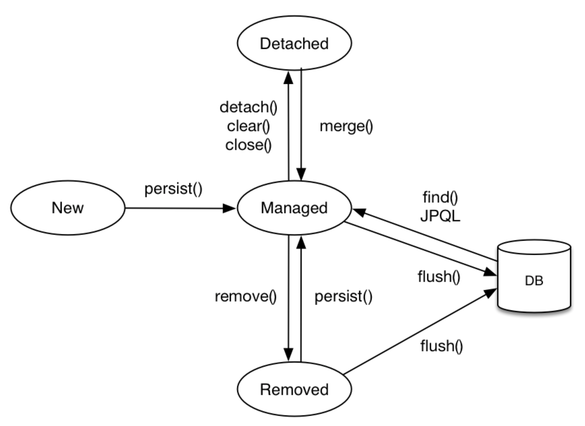

## 영속성 컨텍스트란?
> 영속성 컨텍스트는 논리적인 개념으로 해석하면 **"엔티티를 영구 저장하는 환경"** 이란 뜻으로..  
> 모든 **엔티티를 DB에서 가져오거나** **DB에 저장하는 캐시**라고 생각하면 된다.

### 엔티티의 생명주기


#### 비영속(new/transient)
* 영속성 컨텍스트와 전혀 관계가 없는 상태로 순수한 객체 상태.
```java
Account account = new Account();
account.setId(1L);
account.setEmail("s20062@gsm.hs.kr");
account.setNickname("전지환");
```