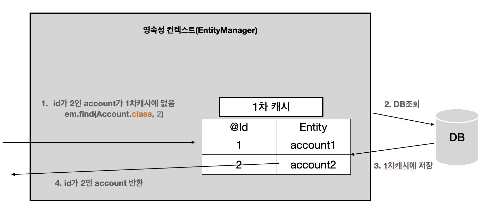

## 영속성 컨텍스트란?
> 영속성 컨텍스트는 논리적인 개념으로 해석하면 **"엔티티를 영구 저장하는 환경"** 이란 뜻으로..  
> 모든 **엔티티를 DB에서 가져오거나** **DB에 저장하는 캐시**라고 생각하면 된다.

### 엔티티의 생명주기


#### 비영속(new/transient)
* 영속성 컨텍스트와 전혀 관계가 없는 상태로 순수한 객체 상태.
```java
Account account = new Account();
account.setId(1L);
account.setEmail("s20062@gsm.hs.kr");
account.setNickname("전지환");
```

#### 영속(managed)
* 영속성 컨텍스트에 저장된 상태로 영속성 컨텍스트에 의해 관리됨
* 영속상태는 DB에 저장된 상태가 아니다(트랜잭션의 commit이 발생한 시점에서 DB로 쿼리를 날린다.)
```java
//영속상태
em.persist(account);


## 준영속(detached)
- 영속성 컨텍스트에 저장되었다가 분리된 상태로 아래의 방법으로 준영속 상태로 만들수 있다.
em.detach(account); // account 엔티티를 준영속 상태로 변경
em.close(); //영속성 컨텍스트 닫기
em.clear(); //영속성 컨텍스트 초기화
```

#### 삭제(removed)
* 삭제된 상태로 영속성 컨텍스트와 DB에서 삭제시킨다.
```
.remove(account);
```

#### 영속성 컨텍스트의 이점
* 1차 캐시
* 동일성 보장
* 트랜잭션을 지원하는 쓰기 지연
* 변경 감지
* 지연 로딩

#### 1차 캐시


```java
Account account = new Account();
account.setId(1L);
account.setEmail("hong@mail.com");
account.setNickname("홍길동");
//캐시에 저장
em.persist(account);
// 1차캐시에 있으니 캐시에서 조회
Account getAccount = em.find(Account.class, 1);
```

> find()를 호출하여 엔티티가 1차 캐시에 존재하면 DB를 조회하지 않고 캐시에서 조회한다.


> 1차 캐시에 없는경우 엔티티 매니저가 DB를 조회하여 엔티티를 생성하고 1차 캐시에 저장한 후 영속상태의 엔티티를 반환한다.



`.find()` 로직에서 1차캐시를 먼저 뒤진 다음에 DB 를 조회하기 때문에 성능상 큰 이점이 있어 보이지만, 1차 캐시는 한 트랜잭션 안에서만 효과가 있어서 성능상 이점이 크지는 않다.

#### 동일성 보장
영속 상태의 엔티티의 동일성을 보장한다. 영속성 컨텍스트의 1차캐시에서 같은 엔티티를 반환하기 때문에 같은 레퍼런스가 된다.

```java
Account account1 = em.find(Account.class, 1);
Account account2 = em.find(Account.class, 1);
System.out.println(account1 == account2); // true
```

#### 트랜잭션을 지원하는 쓰기 지연
엔티티를 등록할 때 (`.persist()`) 엔티티 매니저는 트랜잭션을 커밋하기 전까지 **내부의 쿼리 저장소에 모아두었다가 쿼리를 DB로 한 번에 보낸다.**

#### 변경 감지 (dirty checking)
영속 상태의 엔티티 수정 시 다시 저장을 하거나 update 한다고 영속성 컨텍스트에 알려줄 필요 없이 수정 후 commit 을 하면 변경을 감지하여 DB에 반영된다.

```java
EntityManager em = emf.createEntityManager();
em.getTransaction().begin();
//영속상태
em.persist(account);

Account getAccount = em.find(Account.class, 1);
getAccount.setEmail("change@mail.com");
em.getTransaction().commit();// transaction 커밋
```