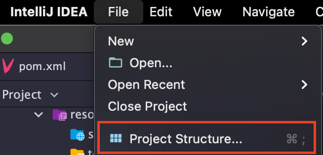
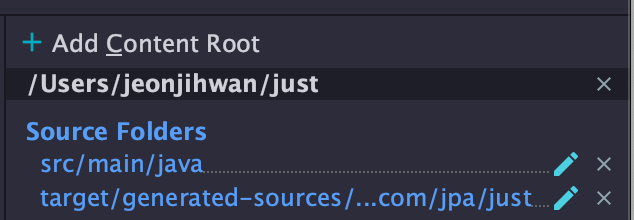

# Maven에 querydsl 설정하기

## 의존성 추가

pom.xml
```xml
<dependencies>
    ...

    <dependency>
    <groupId>com.querydsl</groupId>
    <artifactId>querydsl-apt</artifactId>
    <version>${querydsl.version}</version>
    <scope>provided</scope>
    </dependency>

    <dependency>
    <groupId>com.querydsl</groupId>
    <artifactId>querydsl-jpa</artifactId>
    <version>${querydsl.version}</version>
    </dependency>

    ...
</dependencies>
```

maven APT plugin -> "QClass Generate Structure 설정도 여기서"

```xml
<project>
  <build>
  <plugins>
    ...
    <plugin>
      <groupId>com.mysema.maven</groupId>
      <artifactId>apt-maven-plugin</artifactId>
      <version>1.1.3</version>
      <executions>
        <execution>
          <goals>
            <goal>process</goal>
          </goals>
          <configuration>
            <outputDirectory>target/generated-sources/java</outputDirectory>
            <processor>com.querydsl.apt.jpa.JPAAnnotationProcessor</processor>
          </configuration>
        </execution>
      </executions>
    </plugin>
    ...
  </plugins>
  </build>
</project>
```

## 여기서 발생할 수 있는 에러

`mvn clean` -> `mvn compile` (Qclass 생성) 시 생성되는 `target/generated-sources/java/` 하위의 QClass를 class 소스코드로 인식하지 못하는 점

`⌘ + ;` 눌러서 project-structure 에 들어간다.



소스폴더에 해당 경로를 추가해준다.

