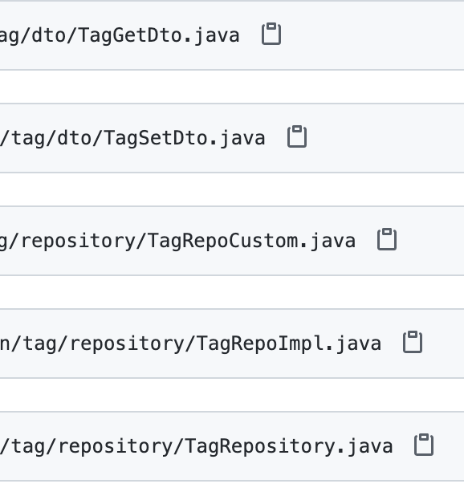

## querydsl 사용시 이것만은 주의하자.
> 일주일동안 해메었던 문제였고 해결했지만 너무나도 어이없는 곳에서의 오류라 난감했고 허무했다. 정말 주의하자.


### 배경
1. Repository extends CustomRepo
2. CustomRepoImpl 만들어서 qeurydsl projection field 사용할 예정
3. ??? 동욱님 레퍼런스 정확히 이해하고 따라 했는데 도대체 왜 안되는걸까??

### 하나하나 차근차근 찾아보자

* 우선 딱 봤을 때 아무문제 없는 file-structure (보고 이상한 점을 못느꼈다면 정말 이 글 잘 본거임)



하지만... 여기에는 크나큰 문제가 있었으니..  
우선 이 자료를 보면 확실하게 이해할 수 있다.

[구해주셔서 감사합니다🙇🏻‍♂️](https://insanelysimple.tistory.com/245)

**하지만 나는 아래와 같이 이 레퍼런스와 같은 오류를 내뱉었던 것 아니였다.**
```
spring data jpa querydsl property not found
```

**나는 아래와 같은 오류가 생겼었음..**
```
No converter found capable of converting from type [com.server.EZY.model.plan.tag.TagEntity] to type [com.server.EZY.model.plan.tag.dto.TagGetDto]
```

하지만.. 시원이가 해준 `repository 분할 그리고 비즈니스 로직에 DI 후 사용` 실험이 정상적인 query 출력이 결과를 통해 알아낸.. 
**원인_1 querydsl projection을 인식못하는 것.**  

설마 설마 하면서 ㅋㅋㅋ class 를 refectoring 했다.. 결과는 성공적.. 

결론적으로.. 클래스 명명규칙이 위 레퍼런스에서 말했던 것과 맞지 않다면..
JPA 가 properties 를 인식하지 못하고 오류를 내뱉는 결과를 초래하게 된다. 

#### 진짜 네이밍은 마음대로 하는 것이 아니다. querydsl 사용시 꼭 주의하길 바란다.