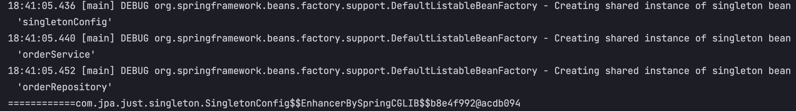
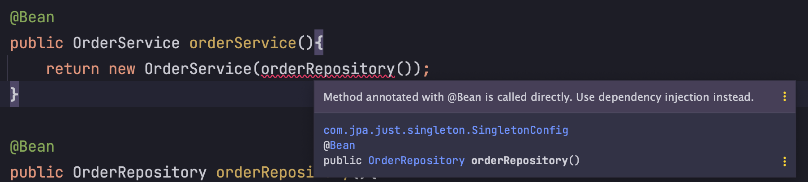

# @Configuration과 바이트코드 조작의 마법

앞전에 `스프링 컨테이너 = 싱글톤 컨테이너`라 배웠다. 그만큼 스프링 컨테이너에서 지원하는 싱글톤이라는 특징을 잘 활용해야 하는 것이다.  
싱글톤 컨테이너에 객체를 `@Bean` 으로 등록하고 전역에서 DI 받아 사용할 수 있다.

객체를 `@Bean`으로 등록하고 스프링 컨테이너에서 DI 받아 사용 했을 때 얻을 수 있는 장점은 **개발자가 복잡한 의존관계에 대해 생각하지 않고, 비즈니스 로직에만 집중할 수 있게 해준다는점** 이다.

## 들어가며..

`@Configuration`은 `CGLIB` 라이브러리를 사용해서 싱글톤을 보장해준다. 사용하지 않아도 `@Bean` 어노테이션을 붙인 객체에 대해서 등록이 되기는 하지만..  
cf. 어디선가 의존성을 관리하는 config 클래스에 `@Configuration`을 달지 않아도 오류는 나지 않는다는 말을 한번쯤은 들어 봤을거다.

(코드로 이해하는게 나을 것 같다.)

### 코드로 알아보기

간단하게 의존성이 있는 클래스를 만들어 보겠다. 

```java
public class OrderService {
    private final OrderRepository orderRepository;

    public OrderService(OrderRepository orderRepository) {
        this.orderRepository = orderRepository;
    }
}
```

`OrderService`는 `OrderRepository`를 주입받아 내부에서 사용한다.  
`OrderRepository` 주입은 싱글톤 컨테이너로 부터 받아야 하는데.. 어디서(service, controller) 호출하든 그럼 전역에서 같은 인스턴스를 보장해야 한다.

`OrderService`와 `OrderRepository` 의 의존성은 아래 클래스에서 관리 하겠다.

```java
@Configuration
public class SingletonConfig {
    @Bean
    public OrderService orderService(){
        return new OrderService(orderRepository());
    }

    @Bean
    public OrderRepository orderRepository(){
        return new OrderRepository();
    }
}
```

`OrderService`는 `orderRepository`를 필요로 하기에 `@Bean`으로 등록되는 시점에 repository 인스턴스로 함께 등록해 줄것이다.  
과연 이 `SingletonConfig.java`를 applicationContext에 등록하여 Bean을 호출하면 싱글톤을 보장해줄지 **아래의 테스트** 를 통해 알아보자.

```java
@Test
@DisplayName("@Configuration을 사용해서 CGLIB을 사용하는 싱글톤 객체 반환하기")
void fitSingleton(){
    AnnotationConfigApplicationContext ac = new AnnotationConfigApplicationContext(SingletonConfig.class);

    // bean 호출
    SingletonConfig bean = ac.getBean(SingletonConfig.class);
    System.out.println("============" + bean);
}
```

아래는 해당 클래스의 출력문이다.


출력문에 보면 `**.SingletonConfig$$EnhancerBySpringCGLIB$**` CGLIB 클래스가 반환된 것을 알 수 있다.  

## 문제를 야기시키는 코드

아까 applicationContext에 등록한 `SingletonConfig` 클래스에 `@Configuration` 애노테이션을 삭제하면 어떤 일이 벌어질까?

```
============com.jpa.just.singleton.SingletonConfig@3c7c886c
```

.getBean() 를 출력했을 때 진짜 java class + 주소가 출력되는 것을 볼 수 있다. (그냥 POJO 로 구현 한거랑 다를 바 없음)  
결론적으로 이렇게 되면 스프링를 쓰는 이유가 없다. 객체는 `@Bean`으로 등록되지만.. singleton이 깨진다. (스프링 컨테이너가 관리하지 않는다.)

### 인텔리제이에서도 경고를 준다. 



> 대충 의존성 주입이 아닌, `@Bean` 메소드가 직접 호출이 되고 있다는 말.

## 결론

이와 같은 문제를 크게 고민할게 없다.  
스프링을 사용하면서 설정 클래스를 만들 때 그냥 `@Configuration`을 사용하여 안전하고 효율적인 싱글톤 컨테이너 기반 개발을 하자!!