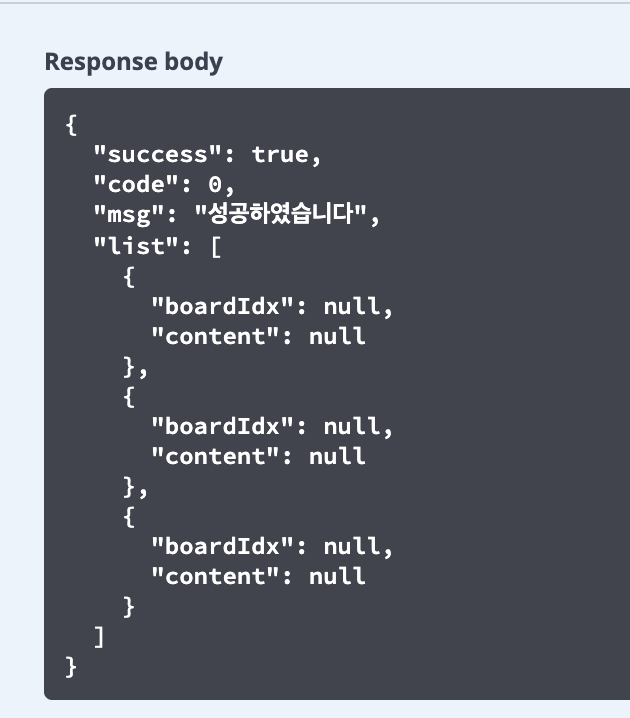

## ModelMapper Entity to DTO 변환 시 프로퍼티 null 해결

문제상황
* findAll() 메서드를 사용할때, 쓸모없는 데이터를 제외한 유의미한 데이터를 끌어오기 위함에서 ModelMapper을 사용
* 계속 select query trace에서는 정확히 나가는데 response code에는 null 이 뜨는 현상

null 이 뜨는 현상

처음에는 service 부분이 문제라고 생각했다.

 

### <ins>하지만 그냥 Dto에 ``Setter``을 안적은게 나의 문제였다</ins>

이유는 이러하다
* "ModelMapper는 해당 클래스의 기본 생성자를 이용해 객체를 생성하고 setter를 이용해 매핑을 한다."
