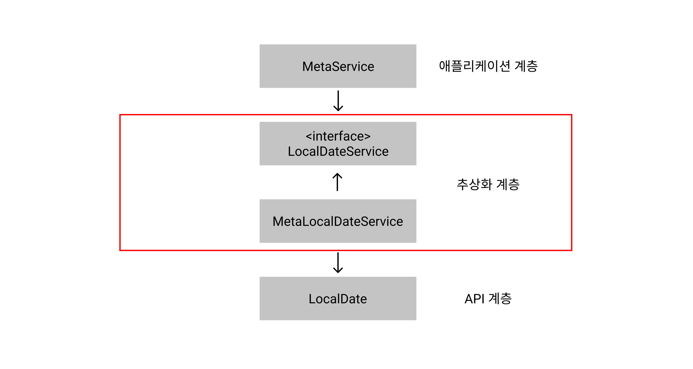

# Portable Service Abstraction
> 환경의 변화와 관계없이. 일관된 방식의 기술로의 접근 환경을 제공하려는 추상화 구조

## 스프링 핵심 기술, PSA

Spring은 특정 기술에 직접적 영향을 받지 않게끔 객체를 POJO 기반으로 한 번씩 더 추상화한 레이어를 갖고 있으며 이를 통해 일관성 있는 추상화를 만들어 냅니다.

* `@Transactional` 애노테이션을 사용하면 JPA든 JDBC든 트랜잭션(Commit, Rollblack..)을 관리할 수 있게 됩니다.

* `@Controller` 애노테이션이 붙어 있는 곳에서 `@GetMapping`, `@PostMapping` 애노테이션을 사용해서 요청을 매핑 합니다.  

> `Spring Web`, `Sring WebFlux`를 예로 들자면.  
> 각 라이브러리에 맞춰 Servlet 애노테이션 매핑을 달리하지 않는다.  

PSA, 추상화 계층이 있어 개발자들은 해당 애노테이션을 편하게 사용할 수 있고.  
제공되는 기술을 다른 기술 스택으로 간편하게 바꿀 수 있는 확장성을 갖게 된다.

## Portable Service Abstraction 적용 사례
참고하세요 🙇🏻‍♂️
> [백기선 PSA:: 이거 모르면 스프링 다시 공부하셔야 해요](https://youtu.be/bJfbPWEMj_c)  
> [k2-server:: static method test PR](https://github.com/themoment-team/K2-server/pull/287)

### 문제
LocalDate 클래스의 `.now()`, `.of()` static method를 사용한 비즈니스 로직을 검증하고 싶다.

```java
private int calculateAfterDate() {
    // LocalDate.now() 오늘
    final LocalDate today = LocalDate.now();

    //  releaseDate: every-moment 출시일
    final LocalDate releaseDate = LocalDate.of(2022, 1, 25);

    // every-moment 출시일 by 오늘
    return (int) releaseDate.until(today, ChronoUnit.DAYS);
}
```

### 접근 1 
LocalDate.now()를 임의의 날짜로 mocking 해서 (ex. 2020. 01. 25) 계산한 값과 비즈니스 로직 값과 `assertEquals()` 한다.

```java
@Test
void example(){
    final LocalDate mockDate = LocalDate.of(2020, 1, 25);

    try(final MockedStatic<LocalDate> localDateMockedStatic = Mockito.mockStatic(LocalDate.class)) {
        localDateMockedStatic.when(LocalDate::now).thenReturn(mockDate);
            
        // api 랑 직접적으로 연결된 메소드
        final int apiValue = metaService.getTermProjectStart();
        // 실제로 계산을 처리하는 메소드
        final Integer businessValue = ReflectionTestUtils.invokeMethod(metaService, "calculateAfterDate", LocalDate.now());

        assertEquals(apiValue, businessValue);
    }

}
```

이 테스트는 적절하지 않을뿐더러 `LocalDate.of()` static method가 호출되는 시점에 NPE 반환한다.  

계속 찾아보고 있지만 아직 정확한 이유를 알아내지는 못했다..   
`LocalDate`를 static method target 클래스로 mocking 해둔 이상 해당 클래스(`LocalDate`)의 **두 개의 static method를 한 번에 mocking 하지는 못하나 보다 ??**

### 절망의 기간.. (도대체 어떻게 테스트 해야하지 못하는건가?)
중간에 mocking한 service 클래스 NPE 해결하는 방법, static method 테스팅 하는 방법 등 여러 가지를 구글링 해봤지만 보이는 건 mockito, powerMock 2.. 내가 접근 1에 소개했던 했던 방식을 알려준다.

구글링을 하면서도 느낀 많다점이 많다.  
프레임워크의 근본(스프링이 해결하고자, 편하게 하고자 하는)에서 문제 해결방법을 고민하는 개발자가 몇 없다는 것을 느꼈다.

### 백기선 - PSA 이거 모르면 스프링 다시 공부하세요. 
> 난 다시 공부하기로 했다 ㅋㅋㅋㅋㅋ 알고보니 토비의 3.1 에서도 언급된 내용이더라.

생각해보면 내가 너무 스프링 기초를 글로만 익힌 것 같다. (깊은 반성 😥)  
스프링 사용하는 이유라고도 할 수 있는 3대 핵심 기술이 있다 **AOP, IoC, PSA..**

AOP, IoC는 DI, Logging을 하면서 매번 언급되어 잘 알고 있었지만..  
PSA는 가깝게 사용하고 있는(Spring MVC, JPA) 기술에도 접목 되었었지만. 깊이 생각하지 못하고 넘어갔던 것 같다.

내가 풀고자 하는 문제를 다이어그램으로 그려보면 아래와 같을 것이다.

<p align="center">
    
</p>

### 접근 2 (실제로 사용하는 Service)

```java
@Service
public class MetaService {

    /**
     * Use spring PSA
     * LocalDateService - 추상화 계층
     */
    @Service
    interface LocalDateService {
        LocalDate getLocalDateNow();
        LocalDate getReleaseDate();
    }

    /**
     * LocalDateService 구현체
     */
    @Service
    static class MetaLocalDateService implements LocalDateService{
        @Override
        public LocalDate getLocalDateNow() {
            return LocalDate.now();
        }

        @Override
        public LocalDate getReleaseDate() {
            return LocalDate.of(2021, 6, 7);
        }
    }
    
    /**
     * 생성자 주입
     * LocalDateService로 추상화 타입을 잡고 MetaLocalDateService를 주입한다.
     */
    private final LocalDateService localDateService;

    public MetaService(MetaLocalDateService metaLocalDateService) {
        this.localDateService = metaLocalDateService;
    }

    // LocalDate.now(), LocalDate.of()가 아닌 interface에 정의된 메소드를 호출한다.
    LocalDate today = localDateService.getLocalDateNow();
    LocalDate releaseDate = localDateService.getReleaseDate();
    
    // 비즈니스 로직 생략
```

이렇게 하면 IoC, PSA 기술을 기반으로 동작하기 때문에 스프링에서 테스트하기가 굉장히 편해진다!  
외부 테스트 라이브러리에도 의존적이지 않아서 더 빠르다! (성능이 더 좋다.)