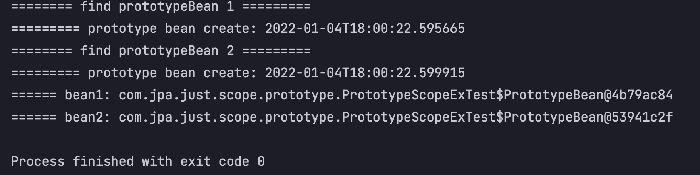

# 빈 스코프, 프로토타입 스코프
> 스코프는 빈이 존재할 수 있는 범위를 말한다.

* 싱글톤: 기본 스코프, 스프링 컨테이너 시작과 종료까지 유지되는 가장 넓은 범위의 스코프.
* 프로토타입: 스프링 컨테이너는 빈 생성과 의존관게 주입, 초기화까지만 관여하고 더는 관여하지 않는 가장 짧은 범위의 스코프. (종료 메소드 호출이 안됨)
* 웹 관련 스코프
  * request: 웹 요청이 들어오고 나갈때 까지 유지되는 스코프.
  * session: 웹 세션이 생성되고 종료될 때 까지 유지되는 스코프.
  * application: 웹의 서블릿 컨텍스트와 같은 범위로 유지되는 스코프.

## 싱글톤 스코프
> 기본으로 만들면 싱글톤 스코프이다. (코드로 확인해 보자)

싱글톤 스코프, 빈으로 등록하여 공유할 자원(클래스)을/를 만든다.
```java
public class SingletonScopeEx {
    private int singletonInteger = 0;

    public int addInteger(){
        return singletonInteger++;
    }

    public int getInteger(){
        return singletonInteger;
    }
}
```

기본적으로 applicationContext 시작과 종료까지 싱글톤으로 유지가 되기 때문에 하나의 인스턴스로 여러 호출에서 돌려 먹는다.
```java
@Test
@DisplayName("singleton scope, 인스턴스를 공유하여 호출마다 값이 누적된다.")
void singletonScopeTest(){
    AnnotationConfigApplicationContext ac = new AnnotationConfigApplicationContext(SingletonScopeEx.class);

    SingletonScopeEx bean = ac.getBean(SingletonScopeEx.class);
    bean.addInteger();
    assertEquals(bean.getInteger(), 1); // True

    SingletonScopeEx bean2 = ac.getBean(SingletonScopeEx.class);
    bean2.addInteger();
    assertEquals(bean2.getInteger(), 2); // True

    assertEquals(bean, bean2); // 같은 인스턴스의 bean을 반환한다.
}
```

## 프로토타입 스코프
> Bean 생명주기 범위를 "프로토타입" 정도로 지정하는 것을 의미한다.

싱글톤 스코프의 빈을 조회하면 항상 같은 인스턴스의 스프링 빈을 반환했지만, **프로토타입 스코프의 빈을 조회하면 항상 새로운 인스턴스를 생성해서 반환한다.**

```java
@Scope("prototype")
public class PrototypeScopeEx {
    private int singletonInteger = 0;

    public int addInteger(){// 생략 }

    public int getInteger(){// 생략}
}
```

이렇게 내가 Bean으로 등록하고자 하는 대상(클래스) 위에 `@Scope("")` 해주면 applicationContext 에서는 **의존관계 주입, 초기화 까지만 담당하게 된다.**  
앞서 말했듯. 새로운 빈 호출(`.getBean()`)시 항상 다른 인스턴스를 반환한다.  

그렇다면, 아까 테스트 케이스를 그대로 실행한다고 했을 때.  
새로운 각각의 빈 인스턴스가 공유되지 않으니 **빈 마다 1을 반환할 것이다.**

```java
@Test
@DisplayName("prototype scope, 호출 마다 인스턴스를 새로 만들어 사용하는 방법")
void prototypeScopeTest(){
    AnnotationConfigApplicationContext ac = new AnnotationConfigApplicationContext(PrototypeScopeEx.class);

    PrototypeScopeEx bean1 = ac.getBean(PrototypeScopeEx.class);
    bean1.addInteger();
    assertEquals(bean1.getInteger(), 1); // 1 is expected

    PrototypeScopeEx bean2 = ac.getBean(PrototypeScopeEx.class);
    bean2.addInteger();
    assertEquals(bean2.getInteger(), 1); // 1 is expected

    assertNotEquals(bean1, bean2); // bean1 과 bean2의 인스턴스는 서로 다르다.
}
```

## `prototype bean`은 bean을 조회하기 직전에 생성된다.

> 이번 테스트코드에서는 `.getBean()`으로 Bean 생성을 요청할 때 마다 인스턴스가 새로 생기는 것을 확인할 수 있을 것이고.  
> prototype scope bean은 의존관계주입, 초기화 까지만 스프링 컨테이너가 관리하기 때문에 `@PreDestroy` 안의 출력문은 출력되지 않는 것을 확인 할 수 있다.

빈으로 등록하여 사용하고 싶은 대상(클래스)
```java
@Scope("prototype")
static class PrototypeBean{
    @PostConstruct
    public void create(){
        System.out.println("========= prototype bean create: " + LocalDateTime.now());
    }

    @PreDestroy
    public void destroy(){
        System.out.println("========= prototype bean destroy: " + LocalDateTime.now());
    }
}
```

```java
@Test
@DisplayName("prototype bean, bean 호출 시점에 생성된다.")
void prototypeBeanCreateAtGetBean(){
    AnnotationConfigApplicationContext ac = new AnnotationConfigApplicationContext(PrototypeBean.class);
    System.out.println("======== find prototypeBean 1 =========");
    PrototypeBean bean1 = ac.getBean(PrototypeBean.class);

    System.out.println("======== find prototypeBean 2 =========");
    PrototypeBean bean2 = ac.getBean(PrototypeBean.class);

    System.out.println("====== bean1: " + bean1);
    System.out.println("====== bean2: " + bean2);

    assertNotEquals(bean1, bean2);
}
```

### 아래의 결과 콘솔을 확인하면 정확히 감을 잡을 수 있을 것이다.



여기서 꼭 확인 해야 할 부분!!
* `.getBean()` 으로 bean을 생성과 동시에 인스턴스 생성
* `bean1` != `bean2`
* process 는 finished 했지만, `@PreDestroy` 종료 메서드가 수행되지 않음.

## 강제로 `@PreDestroy`를 사용하는 방법.

```java
@Test
@DisplayName("prototype bean, bean 호출 시점에 생성된다.")
void prototypeBeanCreateAtGetBean(){
    // 생략
    bean1.destroy();
    bean2.destroy();
}
```

이렇게 빈의 destroy 메소드를 직접 호출해 주면 된다.!!  
감사합니다.