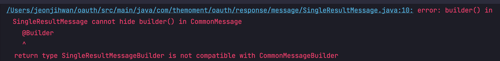

# 상속관계에서의 Lombok @Builder 사용
> Builder 패턴은 내 [GoF 디자인패턴](https://github.com/jyeonjyan/GoF) 레포지터리에서 다루었던 디자인 패턴이기도 하다.

## 문제상황

```java
@Getter
public class CommonMessage {
    private final int code;
    private final String message;

    @Builder
    public CommonMessage(int code, String message) {
        this.code = code;
        this.message = message;
    }
}
```

```java
@Getter
public class SingleResultMessage extends CommonMessage{
    private final Object result;

    @Builder
    public SingleResultMessage(int code, String message, Object result) {
        super(code, message);
        this.result = result;
    }
}
```

상속관계에서의 Lombok `@Builder` 사용이 문제를 야기한다  
이처럼 `CommonMessage`가 `SingleResultMessage`을 자식으로 둘 때. `SingleResultMessage` 빌더 생성자에 아래 컴파일 에러가 발생한다.



## 해결방안

빌더는 복잡한 객체의 생성 과정을 분리하여 처리하는 패턴이다.  
lombok `@Builder`를 부모(P) 자식(C)에 모두 두면 자식(C) 클래스가 동일한 이름의 두 빌더를 모두 노출하려고 하기 때문이다.  

여기에는 해결방법이 두 가지 존재한다.  
첫 번째. 자식 빌더 생성자에 builderMethodName 옵션을 추가한다 (ex. `@Builder(builderMethodName = "singleResultMessageBuilder")`)  
두 번째. 부모 클래스에 모든 생성자 `@AllArgsConstructor` 를 만들어야 한다. 자식에는 클래스에 `@Builder`를 붙이는게 아니라 생성자에 붙여야 한다.

### 첫 번째 방법

자식(C) 클래스
```java
@Getter
public class SingleResultMessage extends CommonMessage{
    private final Object result;

    @Builder(builderMethodName = "singleResultMessageBuilder")
    public SingleResultMessage(int code, String message, Object result) {
        super(code, message);
        this.result = result;
    }
}
```

자식 클래스 빌더 사용부
```java
SingleResultMessage message = SingleResultMessage.singleResultMessageBuilder()
        .code(StatusSpec.OK.getCode())
        .message(StatusSpec.OK.getDetails())
        .result(Hello.data)
        .build();
```

### 두 번째 방법

부모(P) 클래스
```java
@Getter
@AllArgsConstructor
public class CommonMessage {
    private final int code;
    private final String message;
}
```

자식(C) 클래스
```java
@Getter
public class SingleResultMessage extends CommonMessage{
    private final Object result;

    @Builder
    public SingleResultMessage(int code, String message, Object result) {
        super(code, message);
        this.result = result;
    }
}
```