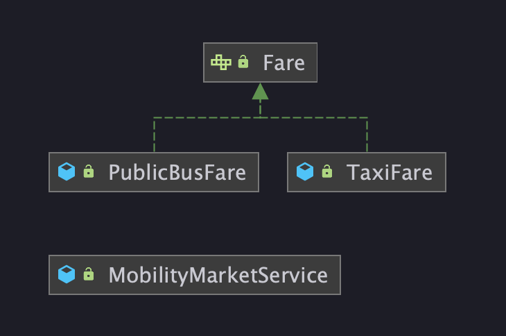
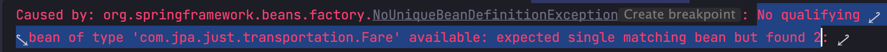

# 스프링 @Autowired 필드 명, @Qualifier, @Primary
> 조회 대상의 빈이 2개 이상일 때 해결 방법

## 서론
조회 대상 빈이 두 개 이상?  
어떻게 생긴건지 코드로 알아보자.



대략적으로 이런 상황에서 발생한다.  
Fare(요금) 이라는 인터페이스를 2개 이상의 클래스에서 구현하고 있는데.

```java
@Service
public class MobilityMarketService {
    @Autowired
    private Fare fare;
}
```

Fare 라는 타입의 인스턴스를 DI 받고싶을 때.  
DI 받아 사용하고자 하는 클래스에 `@Autowired`를 사용하여 주입하게 될 거다.  

`@Autowired`는 가장 먼저 타입으로 Bean을 조회한다.  
근데 아까 말했듯 Fare를 구현하고 있는 클래스가 2개라 어느 클래스를 DI 받아야 할지 난감한 상황이 발생한다. `NoUniqueBeanDefinitionException`



### 이런 상황을 어떻게 해결하면 좋을까?

## 문제 해결
1. `@Autowired` 필드명으로 조회

```java
@Service
public class MobilityMarketService {
    @Autowired
    private Fare taxiFare;
}
```

이렇게 필드에 내가 DI 원하는 클래스 명을 명시하는 방법이 있다.

2. `@Qualifier` 를 사용하는 방법

```java
@Service
public class MobilityMarketService {
    @Autowired
    @Qualifier("publicBusFare")
    private Fare fare;
}
```

3. `@Primary`를 사용하는 방법

```java
@Component
@Primary
public class TaxiFare implements Fare{
    // 생략
}
```

이와 같은 오류가 발생하면 현명하게 대처하자.