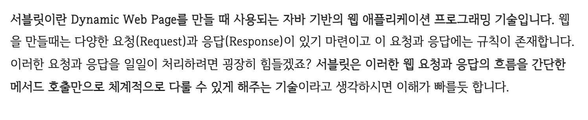
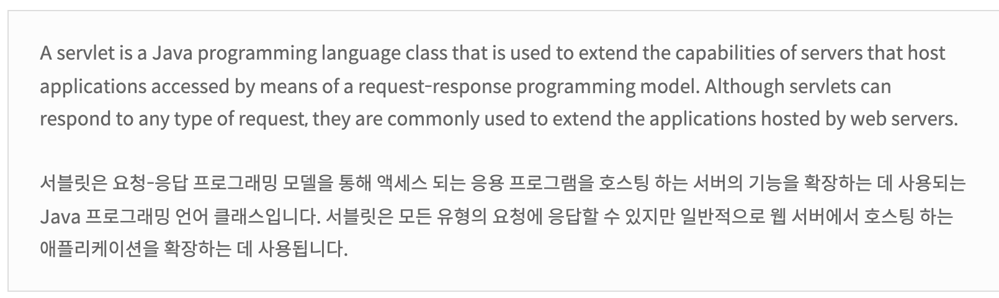
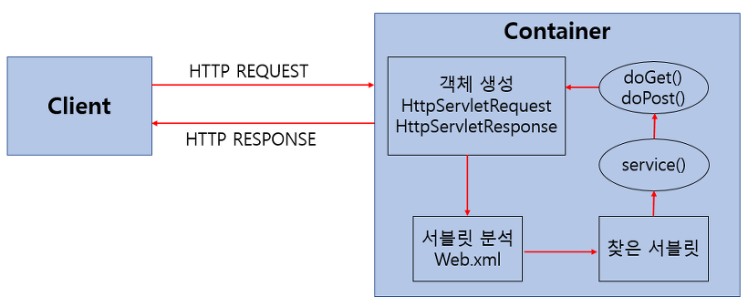
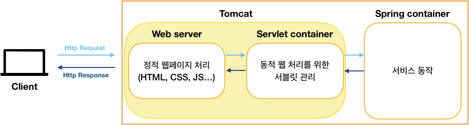
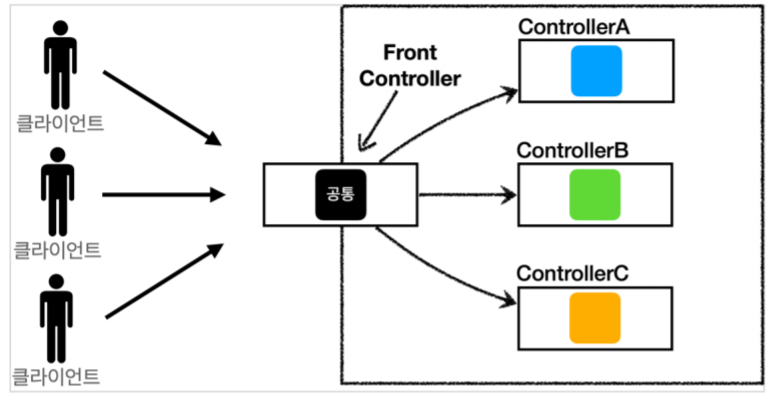
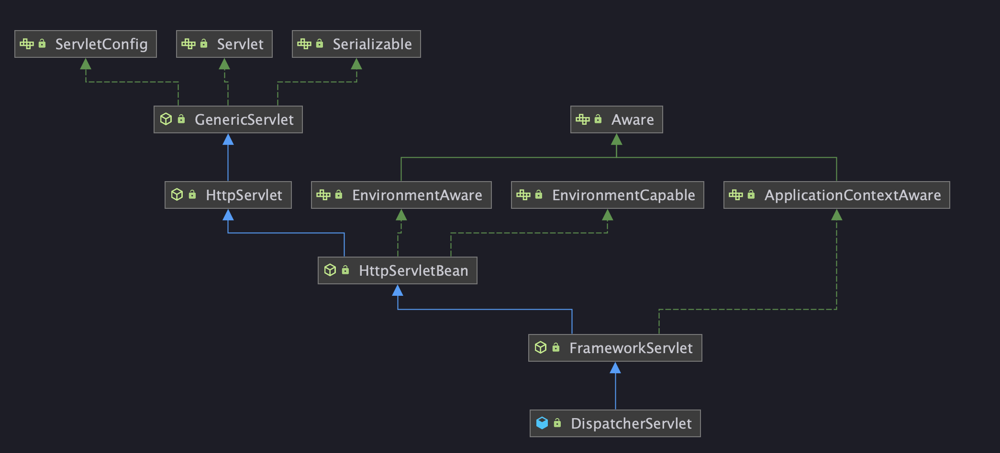

# Dispatcher Servlet이 대체 뭐하는 녀석인다.
> 나는 예전에 Spring MVC 동작 원리를 설명한적이 있다.  
> 하지만 Dispatcher Servlet이 기술면접에서도 자주 등장하는 녀석이라 깔끔하게 짚고 넘어가려고 한다.

우선 springboot 를 공부하자니 AOP, PSA, Application Context 등 너무 방대한 용어들 사이에 DispatcherServlet 도 그 중 하나이다.

간략하게 정리하자면 DispatcherServlet 은 "개발자에게 서블릿 컨텍스트 구현의 책임이 아닌 스프링 컨텍스트 구현의 책임을 주는 것"이다.

더 자세하게 알아보자..

일단 DispatcherServlet 을 이해하려면 Servlet 이 뭔지를 알아야 함. 구글링을 해보자.. 

 

아무튼 웹 애플리케이션의 다양한 요청과 응답을 간단한 호출만으로 체계적으로 다룰 수 있게 해주는 기술이다.

이게 JavaEE에 종속된 기술로 JavaEE docs를 참고하면 아래와 같다.



아무튼 **로우 레벨 기술을 개발자 대신 구현해서 더 쉽게 사용할 수 있게 한 기술이다.** 좁은 의미로는 "자바 기반의 동적 웹 페이지를 제공하기 위한 기술로 설명하기도 합니다."

## 서블릿을 사용하는 방법

```java
/**
 * 주로 서블릿의 생명주기 관리 메서드를 작성
 */
public class GenericServlet implements Servlet, ServletConfig, Serializable {
    @Override
    public void init(ServletConfig config) throws ServletException {

    }

    @Override
    public void service(ServletRequest req, ServletResponse res) throws ServletException, IOException {

    }

    @Override
    public void destroy() {

    }
```

```java
/* HttpServlet.java */
/* Http 관련 기능을 확장한 Servlet */
public abstract class HttpServlet extends GenericServlet {
    ...
    protected void doGet(HttpServletRequest req, HttpServletResponse resp) throws ServletException, IOException {
        String msg = lStrings.getString("http.method_get_not_supported");
        this.sendMethodNotAllowed(req, resp, msg);
    }
    ...
    protected void doPost(HttpServletRequest req, HttpServletResponse resp) throws ServletException, IOException {
        String msg = lStrings.getString("http.method_post_not_supported");
        this.sendMethodNotAllowed(req, resp, msg);
    }

    protected void doPut(HttpServletRequest req, HttpServletResponse resp) throws ServletException, IOException {
        String msg = lStrings.getString("http.method_put_not_supported");
        this.sendMethodNotAllowed(req, resp, msg);
    }
    ...
}
```

## HttpServlet의 동작 과정



HTTP 요청마다 요청을 처리할 서블릿을 생성하고, 생성한 서블릿을 요청에 매핑하여 HTTP Request를 처리하는 Actor로 사용한다.

여기까지가 서블릿을 통해 Http 요청을 처리하던 방식입니다.  
위의 패턴은 서블릿을 상속하는 방식이기에 개발자의 코드를 서블릿이라는 기술에 종속되게 된다는 큰 문제점이 있습니다.  

**JavaEE가 시장되어 현재는 거의 사용하지 않는 이유도, 코드의 기술 결합도를 너무 높여서 재사용성을 떨어뜨린다는 것이였는데,** 서블릿에서도 그 모습을 확인할 수 있습니다.

스프링은 이러한 문제점을, 컨테이너 계층을 Servlet Container - Spring Container 로 분리하고 DispatcherServlet을 통해 연결하여 해결합니다.

## Spring Container와 Spring Container을 연결하는 DispatcherServlet



앞서 말했듯, Servlet Container은 Http요청과 Servlet을 맵핑하여 처리합니다.  

그래서 JavaEE 등의 레거시에서는 Servlet 추상 클래스의 구현체를 만들어 사용했으나, 스프링 MVC에서는 DispatcherServlet 이라는 하나의 서블릿을 통해 모든 요청을 처리합니다.

**이러한 방식을 FrontController 패턴이라고 부릅니다.**



스프링 MVC의 DispatcherServlet이 Servlet 구현의 책임을 갖고, **개발자는 서블릿이 아닌 스프링 컨텍스트 작성의 책임을 갖기 때문에 기존의 JavaEE 에 종속된 프로그램을 만들어야 했던 패턴을 벗어나 지금의 POJO 지향 프로그램 개발이 가능했다.**

## 결론
DispatcherServlet은 Servlet Container에 포함된 개념이기 때문에, DispatcherServlet 에서 Spring Container를 참조할 수 있기만 한다면, 두 컨테이너의 연결은 성립한다고 볼 수 있다.  

사실상 SpringContainer도 ApplicationContext을 의미한다고 볼 수 있다.  
다시 말하면 Spring container를 참조할 수 있다는 것은 ApplicationContext를 알고 있다는 것이고, 이러한 맥락에서 클래스에 ApplicationContext를 주입하는 인터페이스인 ApplicationContextAware 를 떠올릴 수 있다.

### GenericServlet 클래스와의 연결이 돼 있는걸 볼 수 있다.

