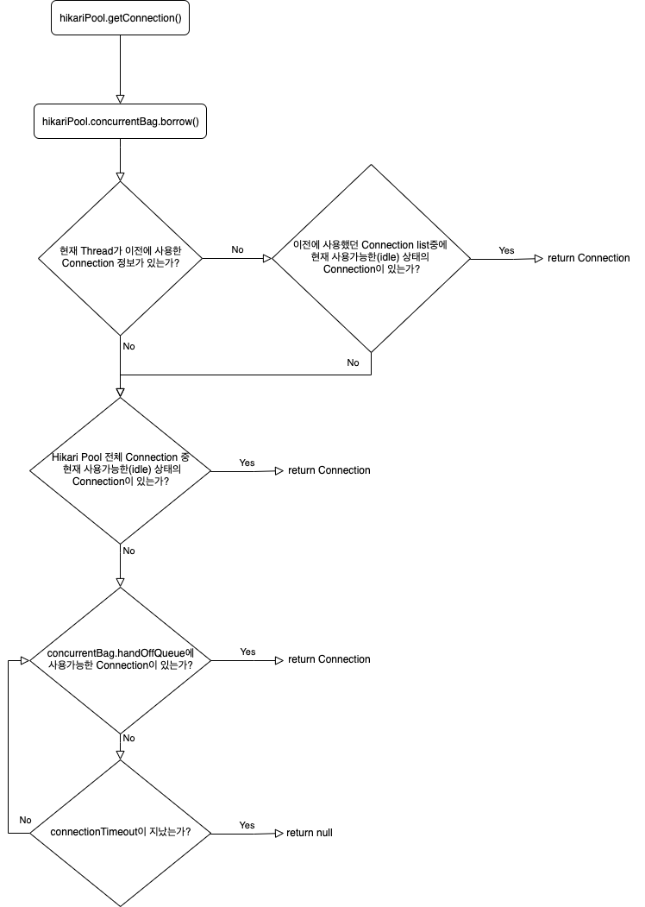
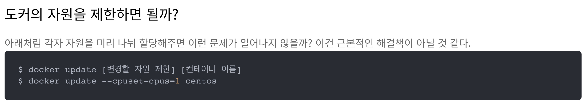
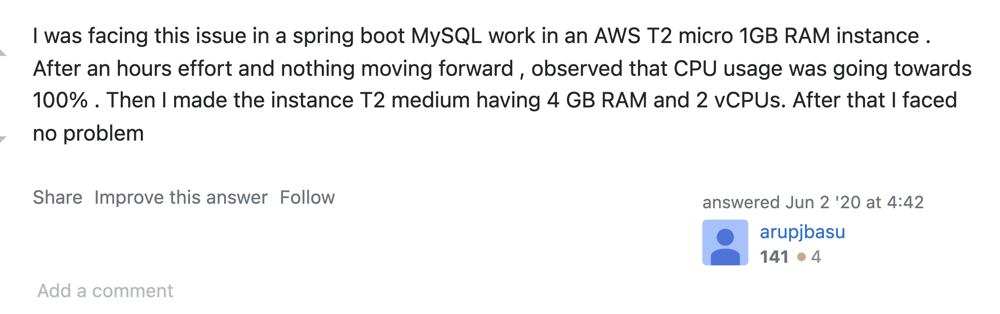

# HikariCP로 인한 장애 회고 

우선 HikariCP 는 springboot 2.x 버전 이후로 기본사양으로 추가되었다.  
본 저자는 Message Queue를 사용하지 않는 환경에서 운영하고 있었고, `hikaripool-1 - thread starvation or clock leap detected (housekeeper delta=1m31s430ms415μs864ns).` 라는 오류가 서비스 초기 운영중 발생해 해당 문제를 분석하여 회고 하려고 한다.

## 배경
본 저자는 springboot application을 docker에 넣어 운영했고, RDS을 조합하여 사용했다.  
서버 app 이 돌아가는 환경은 aws, t2-micro 이며, DBMS 는 mysql 을 사용했다.

## 이해하기
원인을 분석하기 전에 HikariCP를 먼저 이해해야 한다.  
앞서 말했듯, HikariCP는 springboot 2.0 부터 기본적으로 설정되어 있는 DB Connection Pool 로써 Zero-Overhead가 특징으로 높은 성능을 자랑하는 DB Connection Pool 이다.  

내가 HikariCP Connection 구조를 이해할 때 본 좋은 [자료](https://bit.ly/3EeTxsT)를 공유하려 한다.  
여기에 첨부한 자료의 저자처럼 대용량 메시징 처리 때문에 발생한 문제는 아니였다.    
우선 우리가 운영하는 서비스의 초기 트래픽은 총 월 500건의 요청 정도를 처리했다. 아무튼 대용량 데이터 처리 때문은 아니라는거다.

HikariCP는 3단계의 로직을 통해 Connection 객체를 얻을 수 있게 되어 있습니다.

### Connection 요청
1. 기존에 Thread가 썻던 Connection 객체가 아직 존재하는지 확인한다.
   1. 기존에 Connection 객체가 `STATE_NOT_IN_USE` 상태면 기존의 Connection 객체를 빠르게 반환한다.
   2. 기존의 Connection이 존재하지만, `IS_USE` 상태면 다음단계로 넘어간다.
2. Pool에 남은 Connection이 있는지 확인.
   1. 있다면 찾은 Connection 객체를 반환한다.
3. Pool의 모든 Connection을 사용하고 있다면, handoffQueue에서 기다리라고 반환한다.
   1. Thread는 HikariCP default Connection timeout 30초에 맞춰 기다린다.

### Connection 반납하기
HikariCP에서 얻은 Connection은 `(ProxyConnection) Connection.close()`를 하게 되면 반납이 된다.  
정상적인 transaction으로 마무리 되거나, Rollback이 호출되어도 `connection.close()`가 호출되어 Connection을 반납합니다.  

1. Connection 을 반납한다.
2. PoolEntry 상태를 `STATE_NOT_IN_USE`로 변경한다.
3. Connection 로그를 저장한다.

## 내 경우의 수 

### thread starvation or clock leap detected
이 오류의 결론적인 문제는 docker 자원 부족이였다.  
그렇다고 docker의 자원을 제한해서 해결될 문제는 아니라고 한다.
[이 블로그를 인용 함](https://bit.ly/3d5RLyv)

## 총평

나는 [stackoverflow](https://bit.ly/3d97nBi) 해당 답변의 방법처럼 인스턴스 용량을 키우니 해결되었다.  
서버 중단의 심적 타격에 비해 단순한 해결법이라 허무했긴 했지만, 나중에 DB Connection관련 에러가 터진다고 해도 이 계기를 통해 빠르게 해결할 수 있을 것 같다.