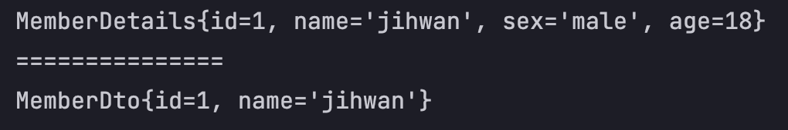
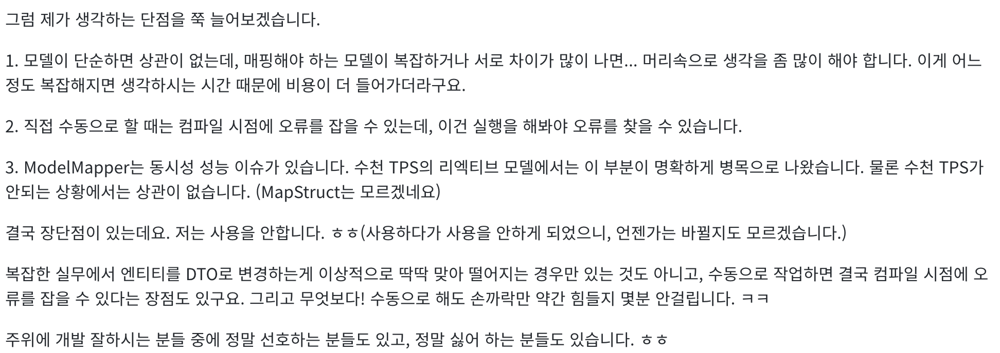

# 사랑해요 ModelMapper ❤️
> ModelMapper, 객체를 변환하는 아름다운 방법, GoF의 23가지 패턴 중 프로토타입 패턴이라고도 할 수 있음.

## ㅈㄴ 쓸 때 없는 서론

내가 ModelMapper를 처음 알게된 때는 바야흐로.. 21년 02월..  
백기선님의 강의를 보다 Entity에서 필요한 정보만 Dto로 반환하여 client 에게 넘겨줄 때 사용하시는걸 보고 우와.. 만 생각하고 그냥 넘어갔던 라이브러리중 하나다.

(리플랙션API를 사용하는 기술 중 하나라고 생각하면 됨.)

왜 그렇게 생각하고 넘어갔냐.. 그때는 리플랙션이고 뭐고 Java 개념적인 부분을 몰라서 아무리 문서를 읽어도 몰랐다 ㅎㅎ..

아무튼 그 이후로는 JPQL(지금은 아예 안씀), Querydsl로 Dto projection 하여 ModelMapper를 쓸 일이 없었다. 근데 [디자인 패턴](https://github.com/jyeonjyan/GoF) (프로토타입 패턴) 배우면서 다시 ModelMapper가 등장하여 이참에 정리 해보려고 한다.

## 들어가기


### config

ModelMapper를 사용하는건 꽤나 단순하다 maven 기준으로 pom.xml 에 아래와 같이 dependency를 등록해준다.

```xml
<!-- https://mvnrepository.com/artifact/org.modelmapper/modelmapper -->
<dependency>
    <groupId>org.modelmapper</groupId>
    <artifactId>modelmapper</artifactId>
    <version>2.4.4</version>
</dependency>
```

### 어케 사용함?

#### Before settings

우선 대상 엔티티 하나 얼른 만들어 볼게요.
```java
public class MemberDetails {
    private Long id;
    private String name;
    private String sex;
    private int age;

    public MemberDetails(Long id, String name, String sex, int age) {
        this.id = id;
        this.name = name;
        this.sex = sex;
        this.age = age;
    }

    // Getter 생략
    // toString() 생략
}

```

난 이걸 아래 Dto 스팩에 맞게 변환하고 싶어.

```java
public class MemberDto {
    private Long id;
    private String name;

    public void setId(Long id) {
        this.id = id;
    }

    public void setName(String name) {
        this.name = name;
    }
    
    // toString() 생략
}
```

미리 결과 값을 예측해 본다면 Entity의 `id, name` 필드만 빼서 Dto type으로 변환되어야 겠죠??

### 결과 내기

```java
// Entity 생성
MemberDetails jihwan = new MemberDetails(1L, "jihwan", "male", 18);

// ModelMapper는 인스턴스를 꼭 생성하여 사용해야 한다.
ModelMapper modelMapper =  new ModelMapper();
MemberDto jihwanConverted = modelMapper.map(jihwan, MemberDto.class);
```

`.map()`의 역할은 대충 느낌만 봐도..  
jihwan이라는 인스턴스를 MemberDto의 인스턴스로 치환하고 싶다는 이야기임.

(ModelMapper에는 더 많은 option들이 존재 함)

#### 이게 결과다



## ModelMapper에 대한 김영한 개발자님의 의견

