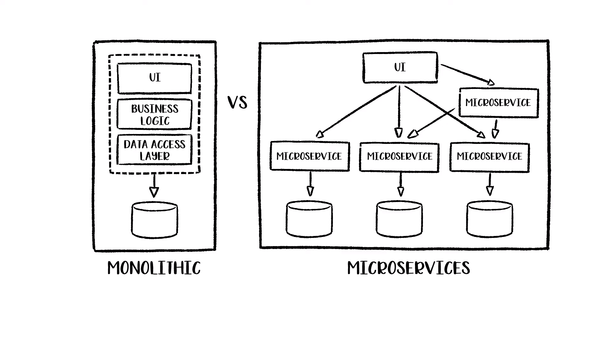

# 우아한 모듈형 모노리스

## 잡음 

당근마켓🥕 1차를 붙었다. 진짜 나랑 친한 몇몇 친구들, 아니 그보다 안되는 친구들이 알고 있다.(최종이 아니라 1차니깐)  
채용 담당자 분께서 메일로 면접관님들의 닉네임을 보내주셨다. 아니 설마 깃헙 이름이랑 같겠어 하고 궁금해서 구글링을 했다.(이래서 구글링은 개발자의 필수 덕목이다)  

1달 전에 대덕에 다니는, Entry-DSM 백엔드 개발을 하고 있는 친구에게 "이거 처음보는 아키텍쳐인데 뭐야?" 라고 물어봤던 적이 있었는데.  
아무튼 그때 "모듈형 모노리스 시스템"으로 개발되었다고 해서 오 ~ 하고 다음에 꼭 공부해봐야지 하고 넘어 갔던 적 있다.

근데 그 모듈형 모노리스 시스템 적용사례, ["우아한 모듈형 모노리스"](https://youtu.be/SrQeIz3gXZg) 를 발표하신 개발자분이 나의 면접관...!  
이참에 모듈형 모노리스 그리고, arawn님의 [발표를 보며](https://www.slideshare.net/arawnkr/ss-195979955) 여러가지를 정리 해보려고 한다.

아참! 모듈형 모노리스 시스템에 대해 정리하기 전에,  

이력서에 MSA에 관심이 많다고 했다.  
실제로도 관심이 많다. 하지만 내가 공감할 수 없는 레벨이다.  
(하지만 뭐든 개념적인 부분은 다져두고 회사에 입사해야 한다고 생각한다.)  

공감할 수 없는 이유는 간단하다.  
도메인을 분산할 정도의 트래픽을 가진 서비스를 운영중에 있는 것도 아니고  
서비스의 도메인중에 특정 부분이 독립적으로 기술적 문제를 풀어나가야 하는 것도 아니기 때문이다.  

그리고 제일 중요한건 배포 파이프라인 구축과 인스턴스 관리가 복잡해지고 어려워진다. 비용도 많이 든다 ^^  
뭔가 모듈형 모노리스는 이런 MSA의 단점들을 보완하면서도 적절히 일반 모노리스 시스템의 단점들을 해결해줄 것이라고 생각이 들었다.

## 들어가며..

arawn님은 배달의민족에서 모노리스 시스템에서 MSA 로 전환하는 과정의 경험을 하셨다고 했다.  
근데 왜 또 MSA 아키텍쳐에서 모노리스로 돌아가고 싶어 하시는걸까? 궁금해졌다. (뭔가 다들 MSA로 마이그레이션해서 장애 발생도 줄이고 쿨 해졌다고 했잖아?)   

처음에 "모듈형 모노리스" 라는 단어를 듣고 굉장히 생소했다. 모노리스인데 모듈형이라고??  

## 왜 모듈형 모노리스인가

세미나에서 모듈형 모노리스를 도입하게된 배경에 대해 그리고 MSA와 모듈형 모노리스 시스템의 장/단점 그리고 왜 우리 조직에는 모듈형 모노리스가 적합했는지 설명해주신다.  

* 조직 내 구성원의 수는 적었지만 프로젝트는 많았다.
  * 개발자 한명이 담당 해야하는 프로젝트가 많다.
* 하나의 테이블을 여러개의 서비스가 공유하여 사용하는 경우.
  * 중복된 코드가 생길 수 밖에 없다.
  * 코드와 로직이 분산되어 있다 보니 서비스끼리 굉장히 복잡하게 동작할 수 박에 없다.
