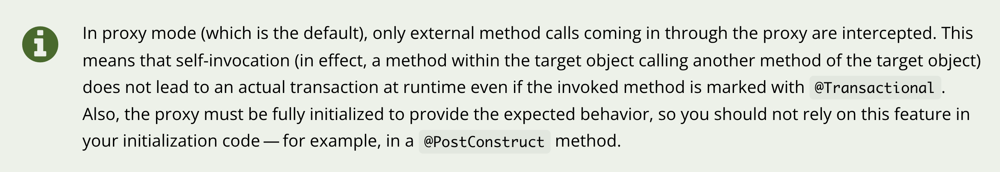
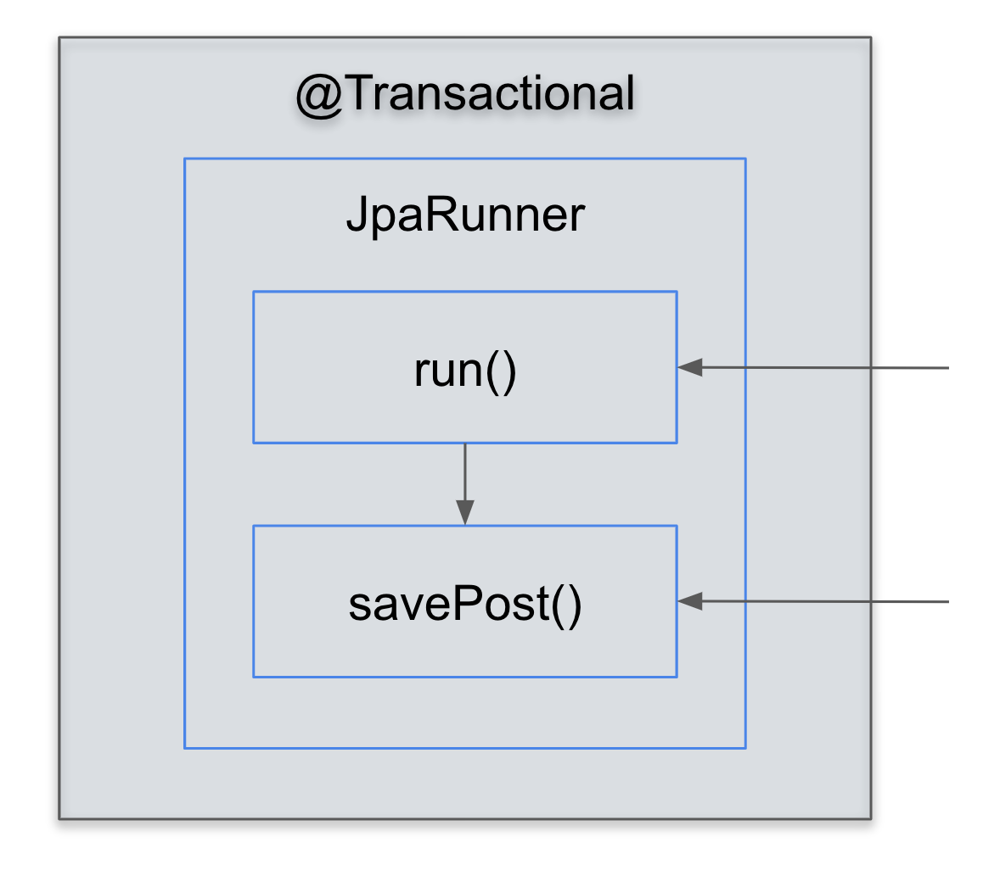

# Spring persistence context 그리고 transactional
> 기선님 [블로그(트랜잭션과 스프링 AOP)](https://www.whiteship.me/spring-transactional-and-spring-aop/)를 보다가 실습하게 된 내용을 공유한다.

## 기선님 예제의 시나리오는 아래와 같다.
1. JpaRunner 라는 클래스에 `run()`, `savePost()` 메소드가 존재한다.
2. `savePost()`는 Post 객체(sp)를 생성하고, `insert` 하는 동시에 `FindById()` JPA 메소드를 사용해서 객체(sp)를 다시 `select` 한다.
3. `run()` 메소드를 통해 실행된 `savePost()` 메소드는 내부 `entityManger.contains(sp)`메소드에 대해 true를 반환할 것이다.

```java
@Component
public class JpaRunner implements ApplicationRunner {

    @PersistenceContext
    EntityManager entityManager;

    @Autowired
    PostRepository postRepository;

    @Override
    public void run(ApplicationArguments args) throws Exception {
        savePost();
    }

    @Transactional
    private void savePost() {
        Post post = new Post();
        post.setTitle("keesun");

        Post newPost = postRepository.save(post);
        System.out.println(postRepository.findById(newPost.getId()));
        System.out.println(entityManager.contains(newPost)); // expected true
    }
}
```

하지만 결과는 `false`.  
결론을 먼저 말하면 `savePost()` 메소드에 트랜잭션이 적용되지 않았기 때문이다.  
트랜잭션이 적용되지 않은 이유는 `@Transactional` 이해하고 있다면 쉽게 알아낼 수 있다고 한다.

## @Transactional은 AOP 기반이며, AOP는 다이나믹 프록시를 기반으로 동작한다.

<p align="center">
    
</p>

Spring 3대 핵심 원리 중 하나인 AOP 기술은 내부적으로 다이나믹 프록시를 기반으로 동작한다.  
프록시 기반 AOP의 단점 중에 하나인 프록시 내부에서 내부를 호출할 때는 부가적인 서비스(예제에서는 `@Transactional`)가 적용되지 않는다.  

호출하려는 타겟을 감싸고 있는 프록시를 통해야만 부가적인 기능이 적용되는데 프록시 내부에서 **내부를 호출 할 때는 감싸고 있는 영역을 거치지 않기 때문이다.**

### 그림을 참고하면 아래와 같다.

<p align="center">
    
</p>

프록시로 감싼 `JpaRunner` 를 외부에서 호출할 때 `run()`이라는 public 메소드를 호출하는데 이 때 `run()` 메소드에는 트랜잭션이 적용되지 않는다.  

> `@Transactional` 애노테이션을 `savePost()`에만 붙였기 때문이다.

또 외부에서 `run()`메소드를 호출한다고 한들 `run()` 메소드에서 호출하는 `savePost()` 메소는 `JpaRunner` 내부에서 호출되기 때문에 티켓을 감싼 트랜잭션이 적용되지 않는다.  

> `JpaRunnerEx` 와 같은 다른 티켓에서 `savePost()`를 호출했다면 트랜잭션이 적용됐을 것이다.

## 따라서 실습하기

```java
@Test
@DisplayName("EntityManager.contains(item)이 false로 반환된다.")
void EntityManager_Contains_Return_False(){
    final Board board = Board.builder()
            .content("아니 이 정대우 돼지놈이")
            .build();

    // persist -> 1차 캐시에 등록
    final Board boardSave = boardRepository.save(board);
    System.out.println("==========================");

    // persist 됐으면.. entityManager에 있겠지.
    final boolean contains = entityManager.contains(boardSave);
    assertFalse(contains);

    // persistent context -> 1차 캐시를 뒤져서 반환
    // select query 날라가지 않음
    boardRepository.findById(boardSave.getId());
}
```

해당 unitTest를 실행해보면 `assertFalse()` 메소드가 실패한다.   
??? 나는 기선님과 같은 시나리오로 한 것 같은데?? 라고 생각할 것이다.  
하지만 **비슷한 시나리오 였을 뿐 가장 중요한 개념을 간과하고 테스트한 것이다.**  

나의 예제 unitTest(`@Test`) 테스트는 `@DataJpaTest` 애노테이션에 의해 실행된다.  
기선님의 예제는 `run()` 메소드에 `ApplicationRunner` 를 구현해 외부에서 호출 할 때 `run()` 메소드를 호출하게 하였다.

기선님이 말한 DFS 학습법을 통해 우리 테스트가 `entityManager.contains()`에 대해서 통과할 수 있었던 이유를 찾아보겠다.

## @DataJpaTest
`@DataJpaTest` 애노테이션은 내부적으로 다양한 기능을 가지고 있지만. 그 중에서 `@ExtendWith({SpringExtension.class})`, `@Transactional` 에 집중해야한다.

```java
@ExtendWith({SpringExtension.class})
@Transactional
public @interface DataJpaTest {}
```

`entityManager.contains():: return true` 결론을 아래와 같이 낼 수 있을 것 같다.  

1. `@DataJpaTest`가 붙어있는 클래스에 대해 `@Transactional`을 전역으로 활성화 하게 됐다.
2. 외부(`SpringExtension`)에 의해 unitTest가 실행되기 때문에 <u>다이나믹 프록시의 단점</u> 또한 해결할 수 있게 됐다. 

해당 unitTest(expected: false)가 실패했다고 볼 수 있다.