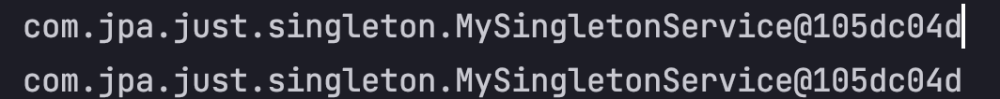

# 싱글톤 컨테이너

스프링의 의존성을 관리해주는 컨테이너는 다양한 이름으로 불린다.  
스프링 컨테이너, IoC 컨테이너, DI 컨테이너, 싱글톤 컨테이너 다 맞는 말이다. 싱글톤 개념은 앞에서 이미 많이 다루었으니 거기를 참고하도록 하자

## 코드로 알아보기

스프링 컨테이너가 싱글톤 컨테이너라는 사실을 입증하기 위해서는 아래의 테스트면 충분하다.

### DI 대상이 되는 컨테이너를 하나 만든다. (@Component)
```java
@Component
public class MySingletonService {
    public String singletonResponse(){
        return "wow it's singleton container";
    }
}
```

### 싱글톤이 맞는지 테스트 하기 -> 객체 생성을 해도 같은 인스턴스를 반환 함.
```java
@Test
@DisplayName("singleton을 유지하는 방법")
void singletonTest(){
    AnnotationConfigApplicationContext ac = new AnnotationConfigApplicationContext(JustApplication.class);

    MySingletonService bean1 = ac.getBean(MySingletonService.class);
    MySingletonService bean2 = ac.getBean(MySingletonService.class);

    System.out.println(bean1);
    System.out.println(bean2);

    assertEquals(bean1, bean2);
}
```

* `new AnnotationConfigApplicationContext()` () 안에 컴포넌트 스캔 할 대상을 넣는다.

### 테스트 결과


## 마무리
spring, springboot 를 쓰는 사람들이라면 당연히 알거라고 생각한다.  
혹, 내 TIL 을 보는 사람 중 아직 몰랐던 사람이 있다면, 직접 구현해서 좀 더 학습해보길 바란다. 

**앞으로의 내용이 다 싱글톤 컨테이너라는 개념을 베이스로 이야기 할 것이다.**
