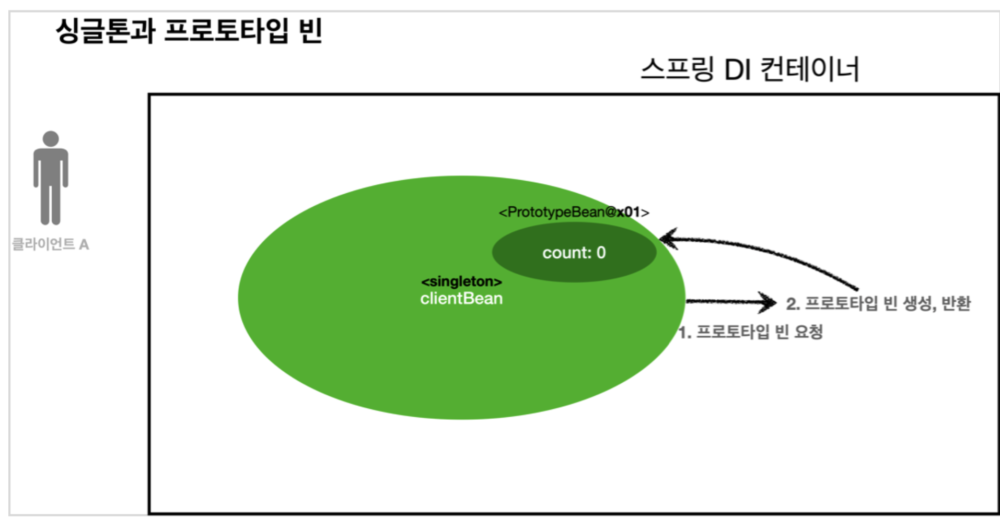

# 프로토타입 스코프 - 싱글톤 빈과 함께 사용시 문제점
> 프로토타입 스코프를 싱글톤 빈과 함께 사용할 때 발생할 수 있는 문제점에 대해 알려주겠다.

이전에 포스팅한 싱글톤 스코프 프로토타입 스코프를 다시 집고 넘어가면.
* 싱글톤 스코프: 빈 생성시 항상 같은 인스턴스를 반환한다.
* 프로토타입 스코프: 빈 생성시 항상 다른 인스턴스를 생성한다.

## 들어가며..



대략적으로 위와 같은 상황이라고 보면 된다.  
코드를 보기 전에 미리 어떤 상황인지 상황극(?)을 만들어 설명해 보려 한다.

## singleton bean

A는 Tesla 매장에 갔다. Tesla 매장에는 Tesla Model S의 재고가 5대 있었다.  
Tesla Model S 의 재고는 모든 클라이언트와 공유해야 한다. `@Scope("singleton"): defualt 라 명시하지 않아도 됨`
```java
@Scope("singleton")
public class TeslaModelS {
    private int stock = 5;

    public void addTeslaModelS(){
        stock++;
    }

    public void buyTeslaModelS(){
        stock--;
    }

    public int getStock(){
        return stock;
    }
}
```

A는 Tesla Model S 1대를 구입한다.  
B도 Tesla Model S 1대를 구입한다.  

테슬라 모델 S 는 수량이 5대로 fix 돼 있었고 2명의 클라이언트가 각 1대씩 구매했으니 **남은 수량은 3대다.**
```java
@Test
@DisplayName("tesla model S의 수량은 모든 클라이언트마다 공유되어야 한다.")
void teslaModelSIsShare(){
    AnnotationConfigApplicationContext ac = new AnnotationConfigApplicationContext(TeslaModelS.class);

    // Client 1이 modelS를 하나 구입한다.
    TeslaModelS bean = ac.getBean(TeslaModelS.class);
    bean.buyTeslaModelS();
    assertEquals(bean.getStock(), 4);

    // Client 2가 modelS를 하나 구입한다.
    TeslaModelS bean2 = ac.getBean(TeslaModelS.class);
    bean2.buyTeslaModelS();
    assertEquals(bean2.getStock(), 3);
}
```

## prototype bean

tesla cart에 (장바구니는 클라이언트 마다 독립적으로 존재해야 한다. = 공유되면 안된다 = 프로토타입 빈) 원하는 차량을 담는다.  

```java
@Scope("prototype")
public class TeslaCartPrototype {
    private int stock = 0;

    public void addToCart(){
        stock += 1;
    }

    public int getNumberOfItems(){
        return stock;
    }
}
```

A는 자신의 cart에 1대의 자동차를 담았다.  
B도 마찬가지로 cart에 1대의 자동차를 담았다.

```java
@Test
@DisplayName("tesla cart는 클라이언트마다 개별적으로 생성되어야 한다.")
void teslaCartIsIndependently(){
    AnnotationConfigApplicationContext ac = new AnnotationConfigApplicationContext(TeslaCartPrototype.class);

    // Client 1 의 Tesla Cart
    TeslaCartPrototype bean = ac.getBean(TeslaCartPrototype.class);
    bean.addToCart();
    assertEquals(bean.getNumberOfItems(), 1);

    // Client 2 의 Tesla Cart
    TeslaCartPrototype bean2 = ac.getBean(TeslaCartPrototype.class);
    bean2.addToCart();
    assertEquals(bean2.getNumberOfItems(), 1);
}
```

여기까지는 앞전에 내가 정리했던 포스팅을 복습한 느낌일 것이다.  
이제 싱글톤빈에 프로토타입빈을 주입할 때 어떤 결과가 발생할 것인지 확인해 볼 것이다.

## Mixed Scope (Singleton & Prototype)

테슬라에서는 전사 직원들이 공유할 수 있는 법인 업무 차량을 신청할 수 있는 폼을 마련했다.  
테슬라 전사 직원들이 공유해야 하는 만큼 빈 설정을 싱글톤 스코프로 지정했다.  


```java
@Scope("singleton")
public class Tesla {
    private final TeslaCartPrototype teslaCartPrototype;

    @Autowired
    public Tesla(TeslaCartPrototype teslaCartPrototype) {
        this.teslaCartPrototype = teslaCartPrototype;
    }

    public int createBusinessCar(){
        teslaCartPrototype.addToCart();
        return teslaCartPrototype.getNumberOfItems();
    }
}
```

직원 A가 Tesla 법인 차량 1대를 장바구니에 추가했다.  
직원 B가 Tesla 법인 차량 1대를 장바구니에 추가했다.  

```java
@Test
@DisplayName("tesla factory가 prototype scope인 modelS의 재고를 늘렸을 때.")
void addTeslaModelSStock(){
    AnnotationConfigApplicationContext ac = new AnnotationConfigApplicationContext(Tesla.class, TeslaCartPrototype.class);

    Tesla bean1 = ac.getBean(Tesla.class);
    int logic1 = bean1.createBusinessCar();
    assertEquals(logic1, 1);

    Tesla bean2 = ac.getBean(Tesla.class);
    int logic2 = bean2.createBusinessCar();
    assertEquals(logic2, 2);
}
```

분명 `TeslaCartPrototype`(장바구니)은/는 프로토타입 스코프인데 어떻게 싱글톤 스코프 처럼 결과가 나올 수 있었을까?  
바로 프로토타입 스코프의 특징에서 알 수 있다.  

프로토타입 스코프로 지정된 Bean은 applicationContext에서 의존관계 `주입 - 초기화` 까지만 관리한다.  
결론적으로 싱글톤 스코프인 Tesla에서 의존관계를 주입하고 한번 초기화를 해서 더이상 application이 prototype Bean을 생성하지 않게 되는것이다.

[Provider 로 문제해결에서 계속...](./solve-with-provider.md)
