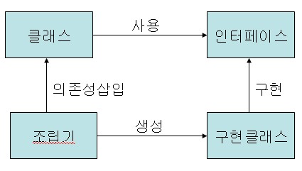
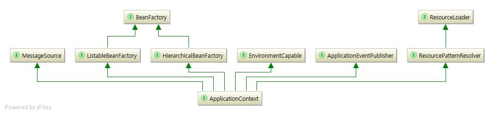

## Spring Bean Life Cycle 

### Java Bean vs Spring Bean
Java Bean 은 데이터를 표현하는 것을 목적으로 하나 자바 클래스이다.  
특별한 점은 없고 Java Bean 규약에 맞춰서 만든 클래스를 뜻한다.  

```
Java Bean 규약
1. 기본생성자가 존재해야 한다.
2. 모든 멤버변수의 접근제어자는 private 이다.
3. 멤버변수마다 getter/setter가 존재해야 한다.
4. 외부에서 멤버변수에 접근하기 위해서는 메소드로만 접근 할 수 있다.
5. 직렬화가 가능해야한다.
```

#### 직렬화
직렬화란 시스템 내부에서 사용하는 객체 혹은 데이터르르 외부의 시스템에서도 사용할 수 있도록 변환시키는 것을 말한다.  
자바에서는 JVM의 Heap 영역에 상주한 객체를 byte 형태로 변환시키거나, byte 형태를 다시 자바 객체로 변환하는 것(역직렬화)를 말한다.

> CSV, JSON format으로 자바 객체를 변경시키는 것도 직렬화하는 것이라고 볼 수 있다.

Serializable interface를 implements한 클래스는 직렬화 할 수 있다.


```java
import java.io.Serializable;

// 직렬화가 가능하도록 Serializable 인터페이스를 구현
public class Person implements Serializable {
    // 모든 멤버변수의 접근자는 private
    private String name;
    private int age;
    private String address;

    // 기본생성자가 있어야한다.
    public Person() {
    }

    // 기본생성자가 있다면 매개변수가 있는 생성자가 있어도 무방함
    public Person(String name, int age, String address) {
        this.name = name;
        this.age = age;
        this.address = address;
    }

    // 각 멤버변수에 접근할 수 있는 getter/setter가 있어야한다.
    public String getName() {
        return name;
    }

    public void setName(String name) {
        this.name = name;
    }

    public int getAge() {
        return age;
    }

    public void setAge(int age) {
        this.age = age;
    }

    public String getAddress() {
        return address;
    }

    public void setAddress(String address) {
        this.address = address;
    }
}
```

Spring은 뷰 영역에 데이터를 출력하고 싶을 때 Java Bean 규약에 맞춰 만들어진 객체를 사용하고, 객체들을 외부 저장소에 저장하고 전송할 때 사용한다.

### Spring Bean 
Spring Bean은 spring Framework의 Container에 등록, 생성, 조회 관계설정이 되는 객체이다. 
Java Object와 동일하지만 IoC 방식으로 관리되는 오브젝트를 뜻한다.  

Spring Bean은 Java Bean과 달리 별다른 생성 규칙은 없다.

### IoC/DI 란?

#### IoC는
IoC와 DI를 한글로 변역하면 제어 역전의 원칙과 의존성 주입이다.  
더욱 쉽게 말하면 대신준다(IoC)와 대신넣어준다(DI)라는 뜻 이다.  
이 때 Spring 에서 대신해주는 것은 미리 찜해놓은 객체를 생성하고 관계를 설정시켜주고 소멸시키는 것이다. 

#### 일반적인 의존관계
보통 프로그램의 실행흐름에 따른다면, 무언가 필요한 쪽에서 필요한 객체를 만들고, 만들어진 객체의 메소드를 직접 호출해서 사용한다.  
여기서 각 객체는 프로그램의 흐름에 능동적으로 참여하게 된다. 이 때 모든 작업은 사용하는 쪽에서 제어한다.

SoccerPlayer.java
```java
class SoccerPlayer {
  private NikeSoccerBall nikeBall;

  public SoccerPlayer() {
    this.nikeBall = new NikeSoccerBall();
  }

  public void playSoccer() {
    System.out.println("축구선수가 공을 찼다!");
    this.nikeBall.touchBall();
  }
}
```  
AdidasSoccerBall, NikeSoccerBall
```java
class AdidasSoccerBall {
  public void touchBall() {
    System.out.println("아디다스 축구공이 굴러간다!");
  }
}

class NikeSoccerBall {
  public void touchBall() {
    System.out.println("나이키 축구공이 굴러간다!");
  }
}
```
Driver
```java
public class Driver {
  public static void main(String[] args) {
    SoccerPlayer sp = new SoccerPlayer();
    sp.playSoccer();
  }
}
```

위 코드를 보면 SoccerPlayer가 `PlaySoccer()` 를 실행하기 위해서는 `NikeSoccerBall` 타입인 `nikeBall`이 필요하고, SoccerPlayer가 직접 `NikeSoccerBall`를 민들어서 사용하고 있다.  
> 이러한 상태를 **SoccerPlayer가 NikeSoccerBall에 의존하고 있다고** 표현 할 수 있다.

만약 축구선수가 다른 축구공을 사용해야 할 경우, SoccerPlayer의 많은 부분을 수정해야한다. 

#### 의존관계의 역전
SoccerBall.java
```java
interface SoccerBall {
  void touchBall();
}

class AdidasSoccerBall implements SoccerBall {
  public void touchBall() {
    System.out.println("아디다스 축구공이 굴러간다!");
  }
}

class NikeSoccerBall implements SoccerBall {
  public void touchBall() {
    System.out.println("나이키 축구공이 굴러간다!");
  }
```

SoccerPlayer.java
```java
class SoccerPlayer {
  private SoccerBall ball;

  public void setSoccerBall(SoccerBall ball) {
    this.ball = ball;
  }

  public void playSoccer() {
    System.out.println("축구선수가 공을 찼다!");
    this.ball.touchBall();
  }
}
```

Driver.java
```java
public class Driver {
  public static void main(String[] args) {
    SoccerPlayer sp = new SoccerPlayer();

    // NikeSoccerBall - NikeSoccerBall로 만든 객체는 SoccerBall 자료형이다. 
    SoccerBall nikeBall = new NikeSoccerBall();
    sp.setSoccerBall(nikeBall);
    sp.playSoccer();

    // AdidasSoccerBall - AdidasSoccerBall로 만든 객체는 SoccerBall 자료형이다. 
    SoccerBall adidasBall = new AdidasSoccerBall();
    sp.setSoccerBall(adidasBall);
    sp.playSoccer();
  }
}
```

SoccerBall를 interface로 만들었고, SoccerBall을 implements하는 각각의 축구공 클래스(Nike, Adidas)를 만들었다.  
축구선수는 축구공을 자신이 만들어서 사용하는것이 아닌 외부에서 만들어진 것을 사용하고 있다.  
이러한 타입을 인터페이스로 바꾸었기 때문에 어떤 공이든 코드에 변경없이 사용할 수 있다.  

축구선수가 축구공에 의존하고 있던 관계가 뒤집힌 것. **이것을 DIP(의존 역전 원칙) 이라한다.**

하지만 아직도 코드를 실행하는 부분에서 SoccerBall의 종류를 선택해여 직접 생성하고 SoccerBall에게 set 해주는 작업을 해야한다.

### Spring IoC/DI 개념을 적용시켜보자

SoccerBall.java
```java
interface SoccerBall {
  String touchBall();
}

@Component("adidasBall") // adidasBall이란 이름을 가진 Bean으로 등록
public class AdidasSoccerBall implements SoccerBall {
  public String touchBall() {
      return "아디다스 축구공이 굴러간다!";
  }
}

@Component("nikeBall") // nikeBall이란 이름을 가진 Bean으로 등록
public class NikeSoccerBall implements SoccerBall {
  public String touchBall() {
      return "나이키 축구공이 굴러간다!";
  }
}
```

SoccerPlayer.java
```java
@Component // 의존성을 주입받는 객체도 Bean으로 등록되어야 한다.
public class SoccerPlayer {
    @Autowired
    @Qualifier("nikeBall")
    private SoccerBall ball;

    public String playSoccer() {
        return "축구선수가 공을 찼다! \n" + this.ball.touchBall();
    }
}
```

SoccerController.java
```java
@RestController
public class SoccerController {
    @Autowired // SoccerPlayer라는 타입을 가진 Bean을 찾아서 주입시킴
    private SoccerPlayer soccerPlayer;

    @RequestMapping("/soccer")
    public String soccerDriver() {
        return soccerPlayer.playSoccer();
    }
}
```

Contoller -> interface 까지 메소드를 타고 들어가보면 `SoccerPlayer` 는 `SoccerBall`을 DI 받고 `SoccerBall` 를 구현하는 클래스가 2개 이상이기 때문에 `@Qualifier` 를 사용해서 대상이 뭔지 더 명확하게 가르키도록 한다.



**스프링의 Container 가 대신 객체를 생성해주고 알아서 객체를 주입해준다.**  
이렇게 생성된 객체는 자신이 어디에 쓰이는지 아지 못한다. 이것이 제어의 역전 원칙이며 스프링은 DI라는 개념으로 구현하고 있다. 


### Container
앞서 Spring Bean이 스프링 컨테이너에 의해 관리되는 객체라는 것을 배웠다.  
그럼 이런 역할을 해주는 Container는 무엇인가.


> 이는 여러가지 이름으로 불린다 Spring Container, DI Container, IoC Container, Bean Controller 등.

스프링 컨테이너는 프로그래머가 작성한 코드의 처리과정을 위임받아 독립적으로 처리하는 존재이다.

### Container를 사용하는 이유
우리는 객체를 사용하기 위해서 new 생성자를 이용하거나 getter/setter 기능을 써야만 했다. 한 어플리케이션에서는 이러한 객체가 무수히 많이 존재하고 서로 참조하고 있을 것이다.

그 정도가 심할 수록 의존성이 높다고 표현한다. 낮은 결합도와 높은 캡슐화로 대변되는 OOP에서 높은 의존성은 매우 지양된다. 

의존성 제어, 즉 객체 간의 의존성을 낮추기 위해 바로 Spring 컨테이너가 사용된다. 

```
- 코드가 깔끔해지고 사용하기 쉽다.
- 재사용하기 좋다.
- 테스트하기 쉽다.
```

### 종류


#### BeanFactory
Bean 객체를 생성하고 관리하는 인터페이스이다.  
디자인패턴의 일종인 팩토리 패턴을 구현한 것이다. BeanFactory 컨테이너는 구동될 때 Bean 객체를 생성하는 것이 아니라. 클라이언트의 요청이 있을 때 getBaen()객체를 생성한다. [lazy init]

#### ApplicationContext
BeanFactory를 상속받은 interface 이다. 부가적인 기능이 많기 때문에 많이 사용한다. ApplicationContext 컨테이너는 구동되는 시점에 등록된 Bean 객체를 스캔하여 객체화한다.[eager init]

```
추가기능
- 국체화 지원 텍스트 메시지 관리
- 이미지 파일 로드
- Listener로 등록된 Bean에게 이벤트 발생 통보
```