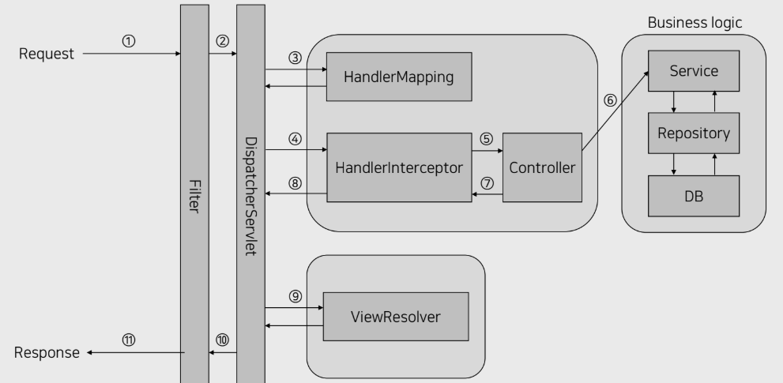

## Spring MVC Lifecycle
> 개발을 하다 exception handling 을 하는데 기본적인 mvc 라이프사이클도 정확히 모르고 있는 것 같아 정리한다.

이 사진 하나면 설명이 가능하다.  

#### Filter
* 여기 filter 은 springboot application 에서 전역적인 로직을 담당한다.  
* 전체적인 필터링을 하는 곳이고, DispatcharServlet에 들어가기 전인 Web Application 딴에서 실행된다. 

#### DispatcherServlet
* App 에 들어오는 모든 req 를 우선적으로 받아 처리하는 서블릿이다.  
* HandlerMapping 에게 req 에 대해 매핑한 Controller 의 검색을 요청한 뒤, Controller 의 정보를 받아 해당 Controller 와 매핑시킨다.  
* Dispatcher 라는 단어 자체가 '배치 담당자' 라는 뜻이 있듯이, 말 그대로 req 에 대해 어느 Controller 로 매핑시킬 것인지 배치하는 역할을 한다. 

#### HandlerMapping
* 아까 말했듯이 DispatcherServlet 로 부터 controller 검색 요청을 받아 처리한 뒤 반환한다.

#### HandlerInterceptor
* req 가 controller 에 매핑되기전 앞단에서 부가적인 로직을 끼워 넣는다.  
* 보통 `세션, 쿠키, 권한 인증` 로직에 사용된다.

#### Controller
* req 와 매핑되는 곳이며, req에 대해 어떤 service 를 처리할 것인지 결정하고, 그에 맞는 service 를 호출한다.  
* spring bean 을 스프링 컨테이너로부터 주입받아야 하고, 이유는 service bean 의 메서드를 호출해야 하기 때문이다.

#### service
* 데이터 처리 및 가공을 위한 비즈니스 로직을 수행한다.  
* req 에 대해 실질적인 로직을 수행하기 떄문에, Spring MVC Request Lifecycle 의 심장이다.  
* service 가 없다면 서버 애플리케이션 존재 이유도 없다.  
* req 를 통해 DB 에 접근하여 데이터의 CRUD를 처리한다.

#### Repository 
* DB에 접근하는 객체이다. DAO 라고도 부른다.  
* Service에서 직접 DB에 접근할 수 있게 하여 데이터의 CRUD를 가능하게 한다.  
