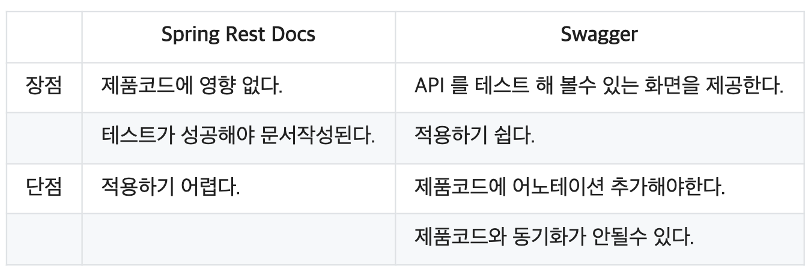

# 프로젝트에 Spring REST Docs 도입하기

#### 참고할 만한 자료  
> [Spring REST Docs 공식](https://spring.io/projects/spring-restdocs)  
> [Spring Rest Docs 적용 - 이호진](https://techblog.woowahan.com/2597/)  
> [SpringBoot @MockBean, @SpyBean 소개 - 이동욱](https://jojoldu.tistory.com/226)

## 전환하는 이유

더모먼트팀은 API 문서를 더모먼트 아카이브 문서함에 관리하고, 추가적으로 Swagger를 통해 API spec을 공유해요.  
규모가 커지면 커질수록 정확한 문서화 보다는 swagger에 의존적인 개발을 하게 되었는데요.  

아카이브 문서함을 확인하면 API spec들이 일관적인 경험을 주지 못할 뿐만 아니라.  
매번 새로운 팀원이 온보딩 할 때마다 swagger를 사용하는데 굳이 따로 문서화를 할 필요가 있냐라는 논쟁이 끊이지 않았어요.

그래서 Spring REST Docs를 통해서 현재 운영 중인 API와 API 문서를 동일하게 관리하기로 했습니다.

## Spring REST Docs 로 전환할 때 고려해야 할 점

Swagger는 client-side 개발자들이 쉽게 API 동작을 테스트하는 용도에 더 특화되어있습니다.  
REST Docs는 적용하는데 상대적으로 비용이 많이 들지만, 깔끔 명료한 문서 다운 문서를 만들 수 있습니다.



## Project Environment

Require Spec

```
Spring Boot - 2.4.x
Gradle 4.8.x
Junit5
MockMvc
Mockito
AsciiDoc
```

## Example

build.gradle
```java
buildscript {
    ext {
        springBootVersion = '2.1.1.RELEASE'
    }
    repositories {
        mavenCentral()
    }
    dependencies {
        classpath("org.springframework.boot")
    }
}

plugins {
    id "org.asciidoctor.convert" version "1.5.9.2" // (1) 
}

apply plugin: 'java'
apply plugin: 'eclipse'
apply plugin: 'org.springframework.boot'
apply plugin: 'io.spring.dependency-management'

group = 'com.example'
version = '0.0.1-SNAPSHOT'
sourceCompatibility = 1.8

asciidoctor {
    dependsOn test // (2)
}

bootJar {
    dependsOn asciidoctor // (3)
    from ("$/html5") { // (4)
        into 'static/docs'
    }
}

repositories {
    mavenCentral()
}

dependencies {
    implementation('org.springframework.boot:spring-boot-starter-web')
    implementation('org.springframework.boot:spring-boot-starter-data-jpa')
    implementation('org.projectlombok:lombok')
    runtimeOnly('com.h2database:h2')
    testImplementation('org.springframework.boot:spring-boot-starter-test')
    testImplementation('org.springframework.restdocs:spring-restdocs-mockmvc') // (5)
}
```

1. AsciiDoc 파일을 컨버팅하고 Build 폴더에 복사하기 위한 플러그인
2. gradle build 시 test -> asciidoctor 순으로 수행
3. gradle build 시 asciidoctor -> bootJar 순으로 수행
4. gradle build 시 ./build/asciidoc/html5/ 에 html 파일이 생긴다
    1.  이것을 jar 안에 /static/docs/ 폴더에 복사가 된다
5. mockmvc 를 restdocs 에 사용할수 있게 하는 라이브러리

나머지 환경 설정은 [여기를 참고](https://github.com/jyeonjyan/springboot-starter)