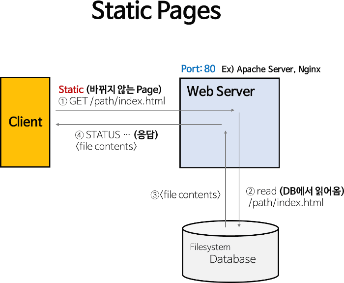
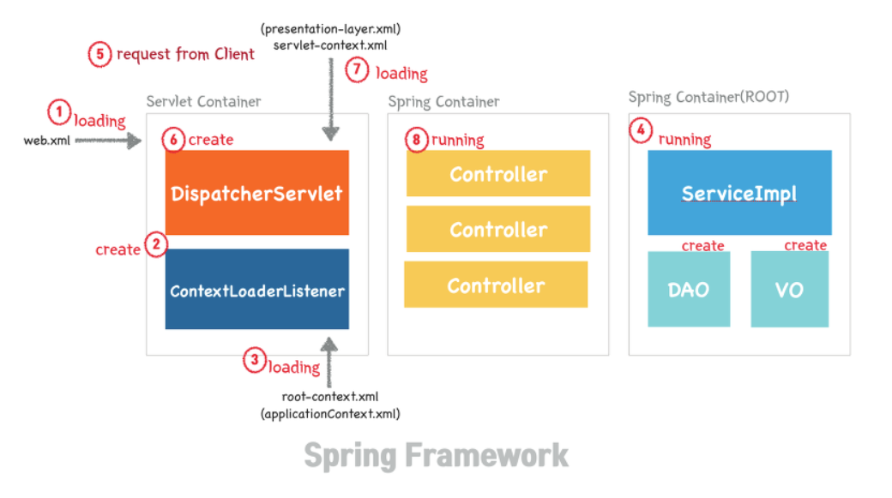
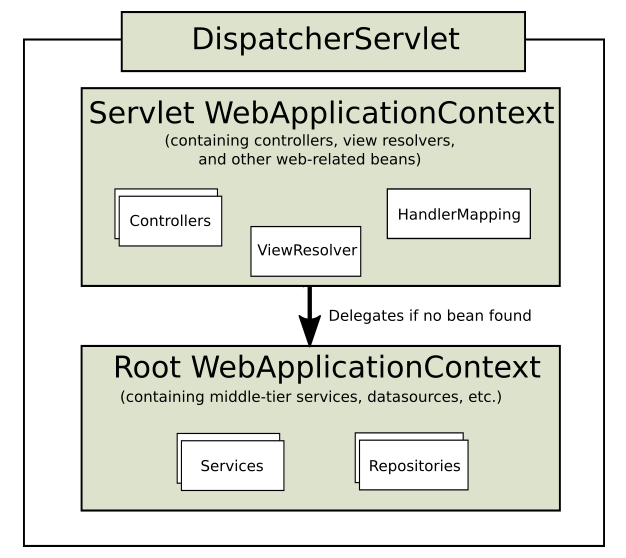

## 스프링 부트 동작원리
> 도움을 주셔서 감사합니다 🙇🏻‍♂️  
> https://velog.io/@nrudev/3.-%EC%8A%A4%ED%94%84%EB%A7%81-%EB%B6%80%ED%8A%B8-%EB%8F%99%EC%9E%91%EC%9B%90%EB%A6%AC


## HTTP
HTTP 통신은 연결을 지속시키지 않고 끊어버리는 Stateless 방식을 사용한다.  
연결을 끊기 때문에 부하가 적지만, 이전에 보냈던 요청이나 되돌려준 응답에 대해서는 기억하지 못한다.  
이러한 점을 보완하기 위해 만들어진 것이 웹서버 이다.

## Tomcat


**정적 페이지** - 서버에 미리 저장된 파일(HTML, file, img, js 파일 등)이 그대로 전달되는 웹 페이지, 서버에 저장된 데이터가 수정되지 않는 한 항상 동일한 페이지.

**동적 페이지** - 서버에 있는 데이터들을 스크립트에 의해 가공처리한 후 생성되어 전달되는 웹 페이지, 사용자의 요청을 해석하여 데이터를 가공한 후 생성된 웹 페이지를 반환하며, 사용자는 상황, 시간, 요청 등에 따라 달라지는 웹 페이지를 보게 된다.

### 웹 서버와 WAS 를 분리하는 이유..
WAS 는 기본적으로 동적 컨텐츠를 제공하기 위해 존재하는 서버이다.  
DB 조회나 다양한 로직을 처리하느라 바쁜 WAS가 정적 컨텐츠 요청까지 담당한다면, 그로 인한 부하가 더 커지게 되고, 수행 속도가 느려져 페이지 노출 시간이 늘어나게 될 것.

**즉 자원 이용의 효율성 및 장애극복, 배포 및 유지보수의 편의성을 위해 WebServer 와 WAS를 분리**

## 동작 순서


* Web.xml - 어플리케이션의 환경을 설정하는 역할을 한다. 서버가 처음 로딩될 때 읽혀서 해당 환경을 Tomcat에 전달한다.
  * ServletContext 초기 파라미터 설정
  * Session 유효시간 설정
  * Servlet/JSP 의 정의 및 매핑
  * Error Pages 처리
  * 리스너/필터 설정
  * 보안

* DispatcherServlet
  * FrontController 패턴 - 최초 앞단의 특정 주소로 요청을 받으면 FrontController 에 넘기고 FrontController 에서는 그 주소에 맞는 자원을 찾아갈 수 있도록 다시 요청한다.
  * 이 경우 요청을 두번 하기 때문에 앞선 요청 정보가 사라지는 문제가 발생해 이를 유지시키는 방법이 필요한데.. 이게 `RequestDispatcher` 이다.

* RequestDispatcher
  * RequestDispatcher는 필요한 클래스 요청이 도달했을 때 FrontController에 도착한 request와 response를 그대로 유지시켜준다.




* Servlet-applicationContext
  * `@Controller`, `@RestController` 를 스캔한다. 해당 파일은 `DispatcharServlet`에 의해 실행된다.
* Root-applicationContext
  * `@Service`, `@Repository` 를 스캔한다.
  * servlet-applicationContext 보다 먼저 로드되고, 때문에 servlet-applicationContext 는 root-applicationContext 가 로드한 객체를 참조할 수 있지만, 그 반대는 불가능

### 결론적으로 어느 로직으로 실행이 되냐?
```
<Booting>
web.xml -> ContextLoaderListener(@Repository, @Sevice - DB 관련 객체 생성) -> root-spring-container

<RunTime>
client (req) -> DispatcharServlet(@Component Scan) -> spring-container(controller)
```