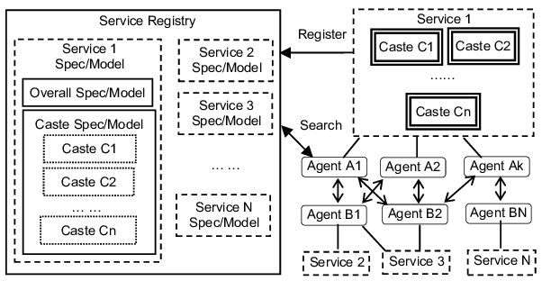

# SOA 그리고 MSA
> 원래도 MSA에는 관심이 많았고, 오늘의집도 관심이 많은 나는 우연히 [surfit](https://www.surfit.io/) 최신 콘텐츠에서 오늘의집 MSA Phase 1 포스팅을 접하게 된다.  
> 읽어보니 API Gateway.. SOA .. etc 개념들이 방대하게 쏟아져 나온다. 한번 SOA와 MSA 같이 정리해보고 API Gateway는 양이 많아 따로 정리해보려 한다.

## SOA (Service Oriented Architecture)

SOA는 1990년대에 정의되어, 2008년에 유행했던 아키텍처 스타일이다.  
현대의 서버 아키텍처는 SOA 사상에 영향을 많이 받았고 많은 분산 아키텍쳐가 거의 이 SOA 사상에 기인한다고 해도 될 만큼 중요한 아키텍쳐이다.

## SOA 개념

* SOA란 기존 애플리케이션들의 기능을 비즈니스적인 의미가 있는 기능 단위로 묶고, 표준화된 호출 인터페이스를 통해 서비스라는 소프트웨어 컴퍼넌트 단위로 재조합한 후, 이 서비스들을 조합하여 업무 기능을 구현한 애플리케이션을 만들어내는 소프트웨어 아키텍쳐