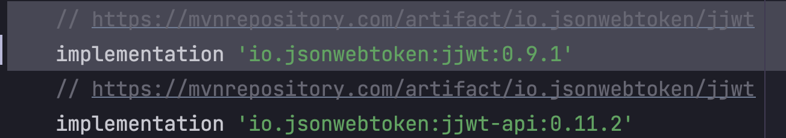

# jwt 의존성 중복으로 인한 기이한 에러

## 발생한 에러


```shell
'can not create bean jwtProvider.....' 
'int io.jsonwebtoken.SignatureAlgorithm.getMinKeyLength()'
```

## 해결 방법



jjwt 와 jjwt-api 의 의존성에 충돌이 발생한다.  
회색 하이라이팅 처리 돼 있는 일반 jjwt 의존성을 삭제하면 해결된다.

(모두들 에러 메시지를 잘 읽자)