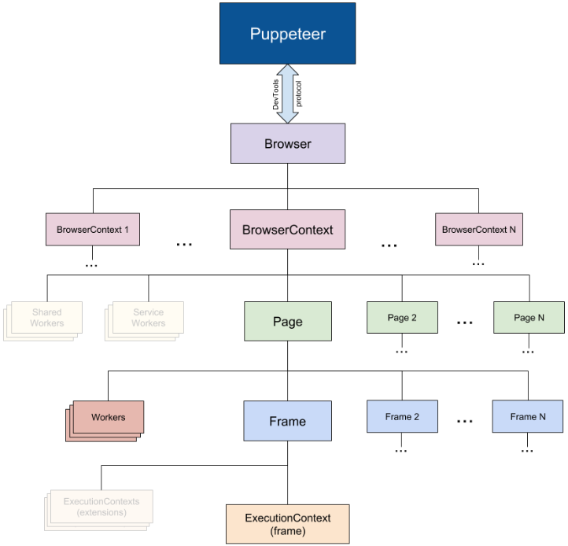

# Puppeteer
> Puppeteer은 Headless Chrome 혹은 Chromium 를 제어하도록 도와주는 라이브러리

## Puppeteer 기능
* SPA 화면의 렌더링이 가능하다.
* 렌더링후 키보드, 마우스 입력 제어를 할 수 있다.
* 웹페이지의 자동 테스트 도구를 만들 수 있다.
* 각각의 웹페이지 crawling이 가능하다.
* 접속한 페이지를 스크린샷을 찍거나 PDF로 만들 수 있다.

## Handless Browser
> Headless Browser은 CLI에서 작동하는 브라우저이다.  
> 일반적으로 사용자가 사용하는 GUI에서 동작하는 브라우저가 아니다.  

백그라운드에서 동작하며, 일반적인 브라우저와 같이 웹페이지에 접속하여 HTML, CSS로 DOM Tree 와 CSSOM Tree를 만들고 JS 엔진을 구동한다.
 

일반 브라우저와 큰 차이가 없어, 화면 테스트나 스크린샷을 찍는 것 등 다양한 기능 동작이 가능하며, 사용자가 실제 사용하는 환경과 비슷하게 테스트가 가능하다.

## Puppeteer의 특징
> Puppeteer에서는 Chrome 혹은 Chromium의 렌더링 엔진을 사용하여 Headless Browser 환경을 구성하였다.

2017년 Google Chrome 59버전 부터 Headless Chrome 이 내장되었고, 얼마후 Google 에서 puppeteer를 발표하였다.
 

여러 iframe 이나 popup으로 이루어진, 복잡한 화면을 제어하는 것이 가능하며, 최근 ES6로 작성된 SPA 화면들도 렌더링 및 제어가 가능하다.
 

DevTools 프로토콜로 Mouse, Keyboard 뿐만 아니라, 브라우저 스크린 크기, 쿠키 및 세션 스토리지, 심지어 서비스 워커도 제어가 가능하다.

## Puppeteer의 구조
Puppeteer API는 계층적이다
* Puppeteer는 하나의 Browser을 갖는다.
* 하나의 Browser는 여러 BrowserContext를 가질 수 있다.
* 하나의 BrowserContext가 여러 Page를 가질 수 있고, Serviceworker와 session을 사용할 수 있다.
* 하나의 Page는 여러 Frame을 가질 수 있다.
* 하나의 Frame은 여러 Context를 가질 수 있다.

## 마무리
> puppeteer은 Headless Chrome을 제어하도록 도와주는 라이브러리다.  
> 이것을 어떻게 이용할지는 오로지 개발자의 몫이다.  
