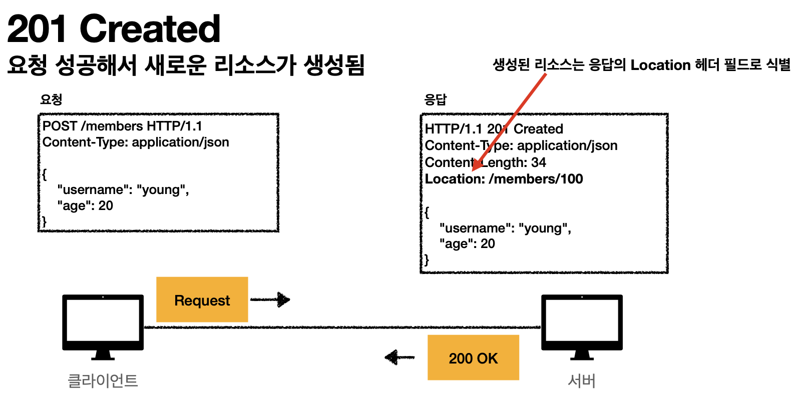

# 2xx - Successful
> 클라이언트 요청을 성공적으로 처리 

* 200 OK
  * 요청 성공
* 201 Created
  * 요청 성공해서 리소스가 생성됨 
  * 
* 202 Accepted
  * 요청이 접수되었으나, 처리가 완료되지 않았음
    * 배치 처리 같은 곳에서 사용 
    * 요청 접수 후 1시간 뒤에 배치 프로세스가 요청을 처리함 
* 204 No Content
  * 서버가 요청을 성공적으로 수행했지만, 응답 페이로드 본문에 보낼 데이터가 없음
  * 예) 웹 문서 편집기에서 save 버튼
  * save 버튼의 결과로 아무 내용이 없어도 된다. 
  * save 버튼을 눌러도 같은 화면을 유지해야 한다.
  * 결과 내용이 없어도 204 메시지 (2xx)만으로 성공을 인식 할 수 있다.

