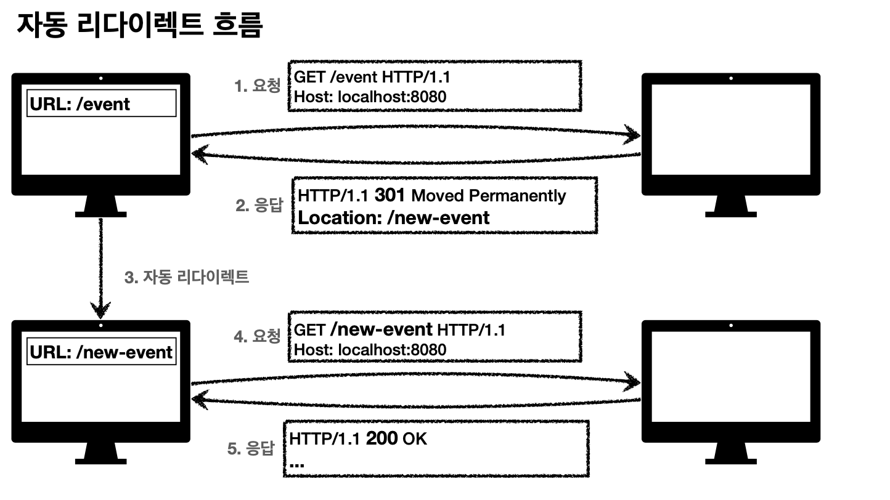
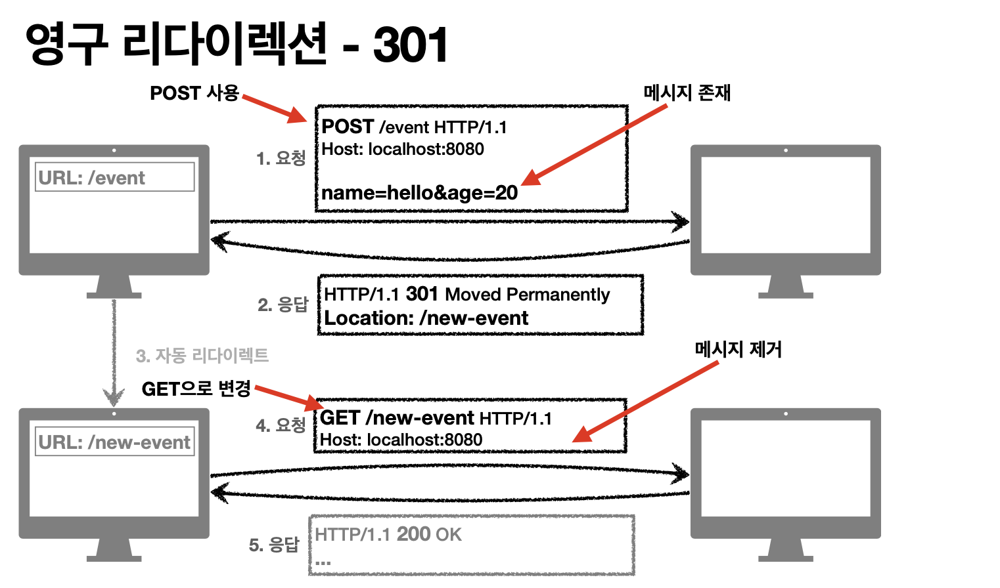
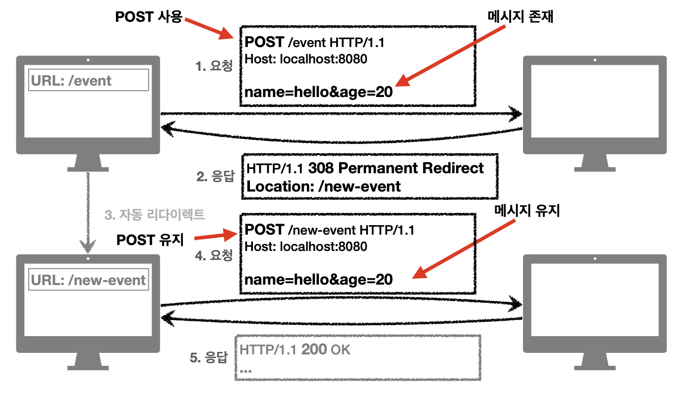
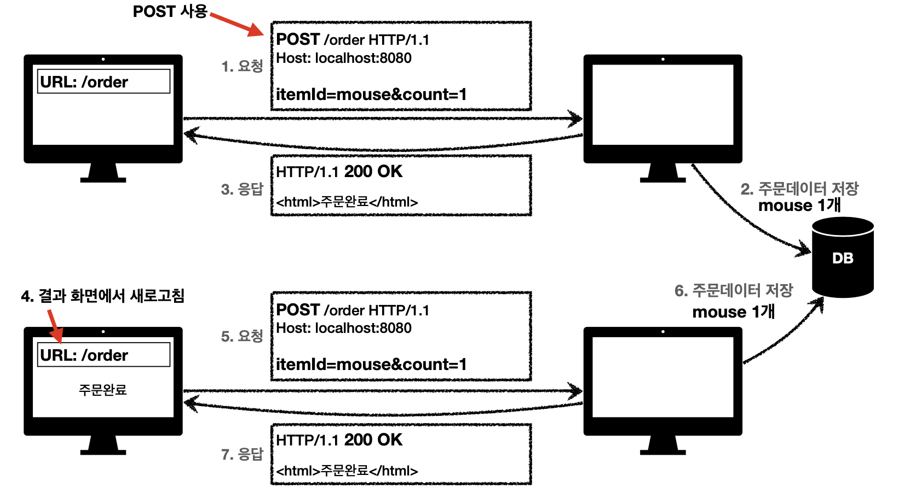
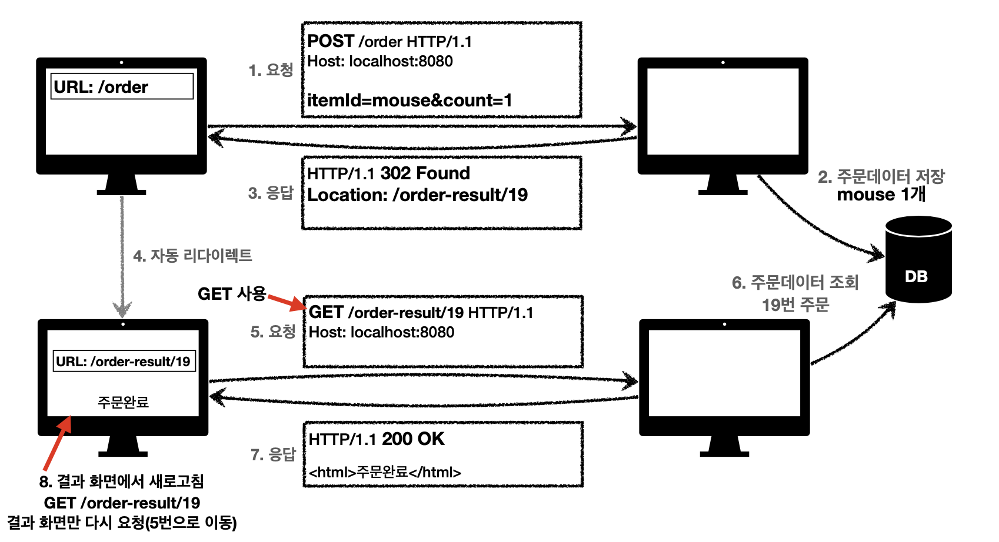
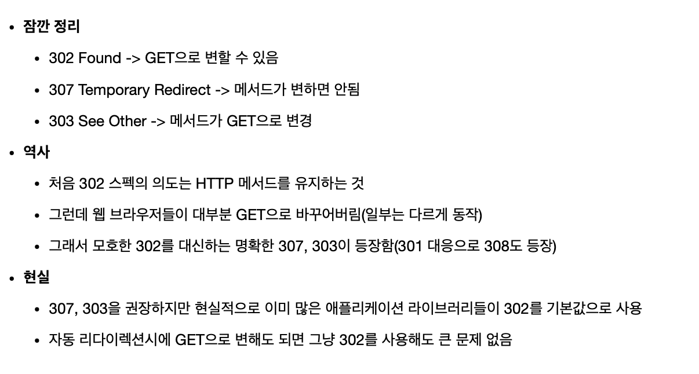

# 3xx - Redirection
> 요청을 완료하기 위해 유저 에이전트의 추가 조치 필요

* 300 `Multiple Choices`
* 301 `Moved Permanently` 
* 302 `Found`
* 303 `See Other`
* 304 `Not Modified`
* 307 `Temporary Redirect`
* 308 `Permanent Redirect`

## 리다이렉션의 이해
* 웹 브라우저는 3xx 응답의 결과에 Location 헤더가 있으면, Location 위치로 자동 이동 (리다이렉트)

### 종류

* 영구 리다이렉션 - 특정 리소스의 URI가 영구적으로 이동
  * ex) /members -> /users
  * ex) /event -> /new-event
* 일시 리다이렉션 - 일시적인 변경
  * 주문 완료 후 주문 내역 화면으로 이동 
  * PRG: Post/Redirect/Get
* 특수 리다이렉션
  * 결과 대신 캐시를 사용

## 영구 리다이렉션 (301, 308)

* 리소스의 URI가 영구적으로 이동
* 원래의 URL 사용 X, 검색 엔진 등에서도 변경 인지
* 301 Moved Permanently
  * 리다이렉트시 요청 메서드가 GET 으로 변하고, 본문이 제거될 수 있음(MAY)
  * 
* 308 Permanent Redirect 
  * 301과 기능은 같음
  * 리다이렉트시 요청 메서드와 본문 유지 (처음 POST 를 보내면 리다이렉트 POST 유지)
  * 

## 일시적인 리다이렉션 (302, 307, 303)
* 리소스의 URI가 일시적으로 변경
* 따라서 검색 엔진 등에서 URL을 변경하면 안됨
* 302 Found
  * 리다이렉트시 요청 메서드가 변하고, 본문이 제거될 수 있음(MAY)
* 307 Temporary Redirect
  * 302와 기능은 같음
  * 리다이렉트시 요청 메서드와 본문 유지(요청 메서드를 변경하면 안된다.)
* See Other
  * 302와 기능은 같음
  * 리다이렉트 요청 메서드가 GET 으로 변경

## PRG: Post/Redirect/Get
> 일시적인 리다이렉션 - 예시

* POST 로 주문 후 웹 브라우저를 새로고침 하면?
* 새로고침은 다시 요청
* 중복 주문이 될 수 있다.

**결론 프론트에서 URI 리다이렉트 하는건 개 야매**

* POST 로 주문 후에 새로 고침으로 인한 중복 주문 방지
* POST 로 주문후에 주문 결과 화면을 GET 메서드로 리다이렉트
* 새로고침해도 결과 화면을 GET으로 조회
* 중복 주문 대신에 결과 화면만 GET으로 다시 요청

## 비슷비슷 한 기능을 가진 상태코드들 그래서 뭘 써야 하나요?

## 기타 리다이렉션
* 300: Multiple Choices : 안쓴다.
* 304: Not Modified
  * 캐시 목적으로 사용
  * 클라이언트에게 리소스가 수정되지 않았음을 알려준다. 따라서 클라이언트는 로컬 PC에 저장된 캐시를 재사용한다.
  * 304 응답은 응답에 메시지 바디를 포함하면 안된다.
  * 조건부 GET, HEAD 요청시 사용

