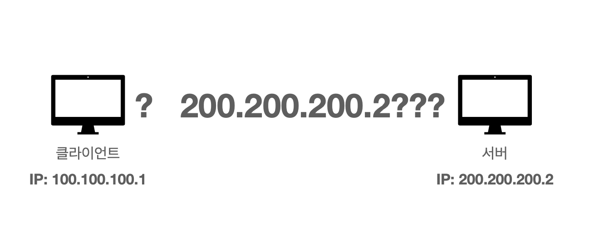
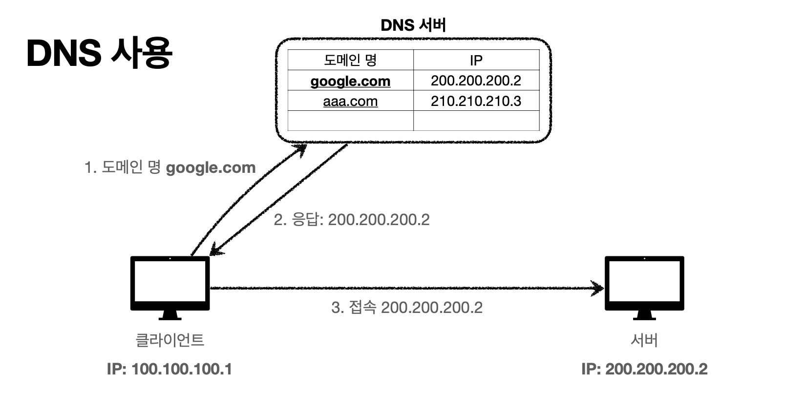

# DNS

## IP는 기억하기 어렵다
저자가 운영하는 서비스 the-moment, 들어가기 위해 `1.23.432.12` 을 사용해야 한다면 어떨까? 그리고 1달 뒤에 `1.253.232.112` 로 바뀐다면 또 어떨까?

### 이처럼 IP는 기억하기 어렵다.
 

**+ 또, 아이피는 변경될 수 있다.**

## DNS
> 도메인 네임 시스템 (Domain Name System)

본 저자는 DNS 관리를 [CloudFlare](https://www.cloudflare.com/ko-kr/)로 하는것을 선호한다. 다양한 기능들을 무료로 즐길 수 있으며 더 많은 기능은 유료로 제공한다. * 무료의 기능도 제법 좋다.

### 인터넷 네트워크 끝