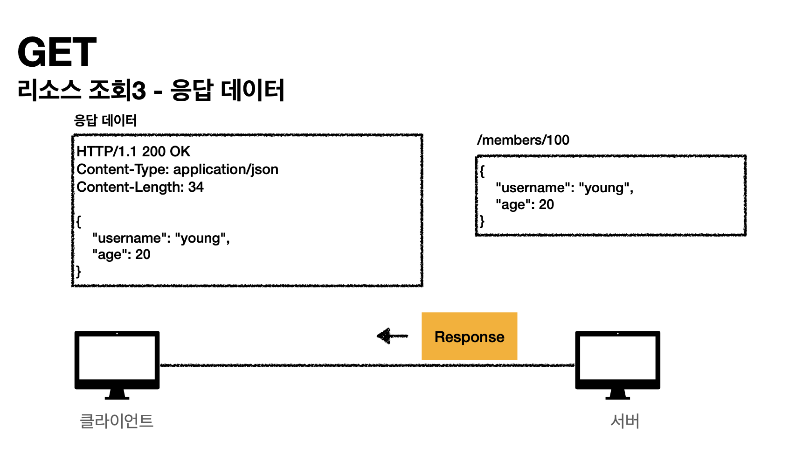
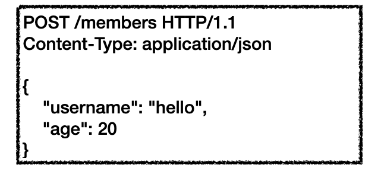
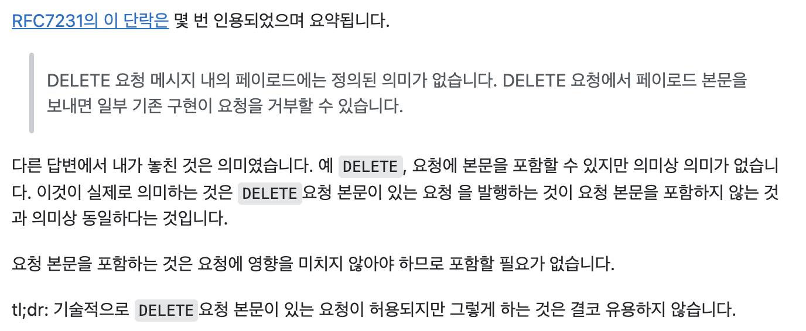

# HTTP 메서드 - GET, POST

## HTTP 메서드의 종류

### 주요 메서드

* GET - 리소스 조회
* POST - 요청 데이터 처리, 주로 등록에 사용
* PUT - 리소스를 대체, 해당 리소스가 없으면 생성
* PATCH - 리소스 부분 변경
* DELETE - 리소스 삭제

### 기타 메서드

* HEAD - GET과 동일하지만 메시지를 제외하고, 상태 줄과 헤더만 반환
* OPTIONS - 대상 리소스에 대한 통신 기능 옵션(메서드)을 설명 주로 CORS에서 사용
* CONNECT - 대상 자원으로 식별되는 서버에 대한 터널을 설정
* TRACE - 대상 리소스에 대한 경로를 따라 메시지 루프백 테스트를 수행


## GET


* 리소스 조회
* 서버에 전달하고 싶은 데이터는 query(파라미터, 스트링)을 통해서 전달
* `RequestBody`를 사용해서 데이터 **전달 가능하지만, 실무에서는 사용 X 권장하지도 X**



## POST



* 요청 데이터 처리
* 메시지 바디를 통해 서버로 요청 전달
* 서버는 요청 데이터를 처리
  * 메시지 바디를 통해 들어온 데이터를 **처리하는 모든 기능을 수행한다.** (사실상 모든 메서드를 대체 가능)
  * 주로 전달된 데이터로 신규 리소스 등록, 프로세스 처리에 사용


혹시 이 질문을 읽고 `??` 라는 의문을 품으셨나요?  
아래의 코드를 한번 읽고 다시 생각해보세요.

```java
    @PostMapping("/withdrawal")
    public CommonResult withdrawal(@Valid @RequestBody SignInDto signInDto) throws Exception {
        // 비즈니스 로직 생략
    }
```

네 바로 DELETE의 기능을 수행하지만, `@RequestBody`로 `SignInDto`를 받는다는게 HTTP 메소드 설계의 주요 골칫거리죠???  

아까 기본적인 이론에서 언급했다 싶이.  
POST 메소드의 "주로 **전달된 데이터**로 프로세스 처리에 사용"하는 속성에 집중해야 하는데요..

이미 이처럼 비즈니스 로직상 DELETE 의 기능을 수행하지만, HTTP 메소드 설계 원칙상 POST가 되는 고민들을 다 하고 계셨더라고요..

[ex stackoverflow](https://stackoverflow.com/questions/299628/is-an-entity-body-allowed-for-an-http-delete-request)  
[ex Kyoungil's Blog](http://blog.leekyoungil.com/?p=390)

 

> 이처럼 HTTP method는 항상 HTTP 메시지 입장에서의 설계를 해야합니다.  
> "회원삭제" 라는 것을 처리하기 위해 회원이라는 리소스 `/member` Body에 Payload를 실어 보내기에 HTTP 메소드는 POST 인겁니다!

근데 저도 HTTP 메서드를 다시 공부해보니.. 실무에서 **POST 컨트롤 URI** 라는게 사용된다고 하더라고요!  
client에서 memberId 상태를 관리하고 있다면, POST `/member/{memberId}/withdrawal`  로 처리하는게 좋을 수 있겠네요 ^^


[다음편에서 계속....]()