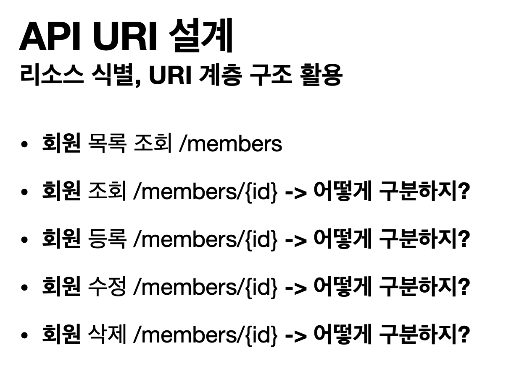

# HTTP 메서드

## index
* HTTP API를 만들어보자
* HTTP 메서드 - GET, POST
* HTTP 메서드 - PUT, PATCH, DELETE
* HTTP 메서드의 속성

## URI 설계
**가장 중요한 것은 "리소스 식별"이다.**

### API URI 고민
* 리소스의 의미는 뭘까?
  * 회원을 등록하고 수정하고 조회하는게 리소스가 아니다 (동사 X).
  * 미네랄을 캐라 -> "미네랄"이 리소스
  * 위에 예시에서는 회원이라는 개념 자체가 바로 리소스이다.
* 리소스를 어떻게 식별하는것이 좋을까?
  * 회원을 등록하고 수정하고 조회하는 것을 모두 배제
  * 회원이라는 리소스만 식별하면 된다 -> 회원 리소스를 URI에 매핑

## 리소스와 행위를 분리
* URI는 리소스만 식별!
* 리소스와 해당 리소스를 대상으로 하는 행위를 분리
  * 리소스: 회원
  * 행위: 저장, 조회, 삭제, 변경
* 리소는 명사, 행위는 동사 ([GET] - /member : 회원을 조회하라)
* 행위 메서드는 어떻게 구분??

#### [다음편에서 계속..](./GET-POST.md)