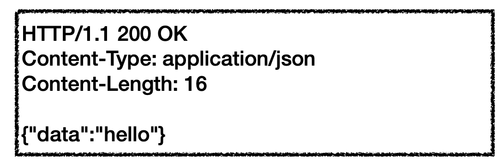

# 표현 (Representation)

## HTTP 표준 

1999년 RFC2616 <- 폐기됨
2014년 RFC7230 ~ 7235 등장

## RFC723x 변화

* 엔티티(Entity) -> 표현(Representation)
* Representation = representation MetaData + representation Data
* 표현 = 표현 메타데이터 + 데이터

## HTTP BODY
> RFC7230(최신)

* 메시지 본문을 통해 데이터를 전달
* 메시지 본문 = 페이로드(payload)
* 표현은 요청이나 응답에서 전달할 실제 데이터
* 표현 헤더는 표현 데이터를 해석할 수 있는 정보 제공
* 데이터 유형, 데이터 길이, 압축 정보 등등
* 참고: 표현 헤더는 표현 메타데이터와, 페이로드 메시지를 구분해야 하지만, 여기서는 생략

## 표현
* Content-Type: 표현 데이터의 형식
* Content-Encoding: 표현 데이터의 압축 방식
* Content-Language: 표현 데이터의 자연 언어
* Content-Length: 표현 데이터의 길이

* 표현 헤더는 전송, 응답 둘다 사용

## Content-Type
> 표현 데이터의 형식 설명

* 미디어 타입, 문자 인코딩
* 예
  * text/html; charset=utf-8
  * application/json
  * image/png

## Content-Language
> 표현 데이터의 자연 언어

* 표현 데이터의 자연 언어를 표현
* 예
  * KO
  * EN
  * EN-US

### 표현 데이터의 우선순위를 설정할 수 있음 
> OS언어 기준일 수도 있고..(설정에 따라 상이 함)

예시 [토스](https://toss.im/) 이렇게 들어가면 Request Header에 language 우선순위를 볼 수 있을 것이다.

## Content-Length
> 표현 데이터의 길이

* 바이트 단위
* Transfer-Encoding(전송 코딩)을 사용하면 Content-Length를 

### [협상(콘텐츠 네고시에이션) 다음화에 계속..](./Negotiations.md)