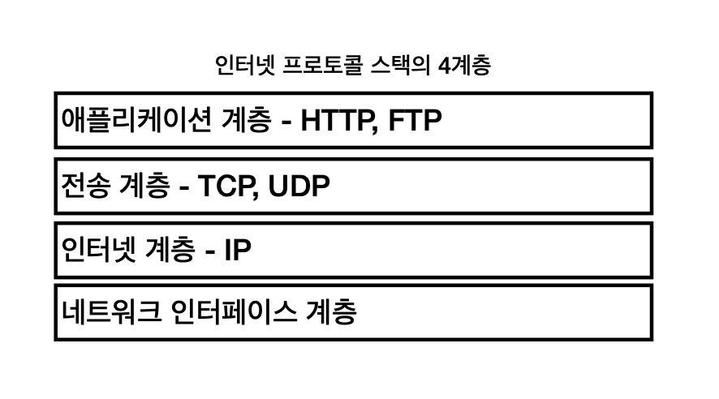
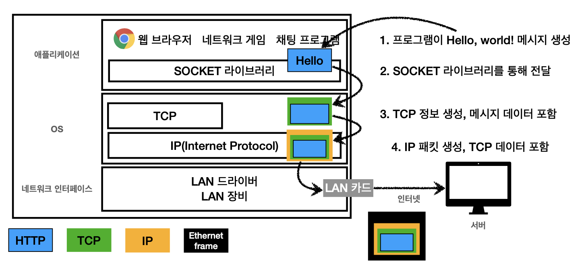
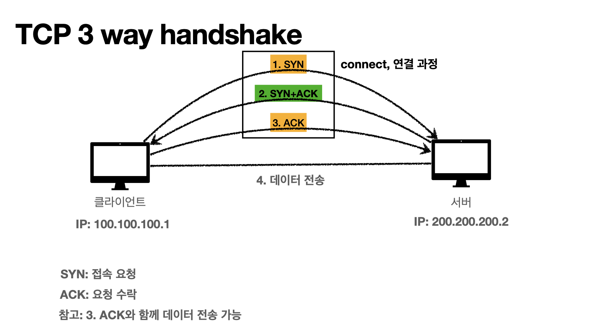

# TCP
> IP 통신의 단점들을 잘 보완해주는 그야말로 대단한 존재이다.

## 인터넷 프로토콜 스택의 4계층

여기서 TCP 는 3계층 전송계층에 속한다.  

## 프로토콜 계층

`Hello, world!` 라는 내용을 전달하기 위해서는 위에 과정같은 방법으로 최종적인 목적지에 도착하게 되는데..  

1. 애플리케이션 단에서 전달 내용을 SOCKET 라이브러리를 통해 전달하고
2. OS/TCP 단에서 패킷 정보(출발지 PORT, 목적지 PORT, 전송 순서 등을) 감싼다.
3. IP 단에서 정보 (출발지 IP, 목적지 IP 등을)를 감싼 후
4. 네트워크 인터페이스 단에서 이더넷 프레임을 최종적으로 감싸 도착지에 전달하게 된다.

여기서 이제 TCP 의 특징을 명확하게 발견할 수 있는데.

## TCP 특징

* 연결지향 - TCP 3 way handshake (논리적)
  * 이 부분은 IP 통신을 할 때의 단점들을 많이 보완을 해주는데 IP 통신에서 일어났던 **패킷 소실, 대상 서비스 불능**을 막아준다.
* 데이터 전달 보증
  * 목적지까지 데이터가 전달 됐는지 아닌지 알 수 있다.
* 순서보장
  * IP 통신에서는 `Hello` 와 `World`의 두 패킷으로 나누어 보내면 순서를 보장할 수 없었지만, TCP 는 가능하다.

### TCP 3 way handshake
> 물리적인 개념이 아니라 논리적인 개념임을 꼭 알고있자.

1. 클라이언트가 서버에게 연결 요청(SYN)을 하면..
2. 서버는 응답(ACK)과 동시에 클라이언트와의 연결 요청(SYN)을 보낸다.
3. 마찬가지로 클라이언트도 응답(ACK)을 한다.

요즘에는 업데이트가 돼서 *3번째 과정 +(바로 패킷을 전달) 한다고 함.

### 결론적으로
신뢰할 수 있는 프로토콜이라 현재는 대부분 TCP를 사용한다고 한다.

## UDP 특징
> 사용자 데이터그램 프로토콜, 하얀 도화지에 비유(기능이 거의 없다)

* 연결지향 X
* 데이터 전달 보증 X
* 순서 보장 X, 단순하고 빠르긴 함

### 결론적으로
* IP 통신과 거의 같지만, +PORT와 +체크섬 정도만 추가
* 애플리케이션에서 추가 작업이 요구된다.