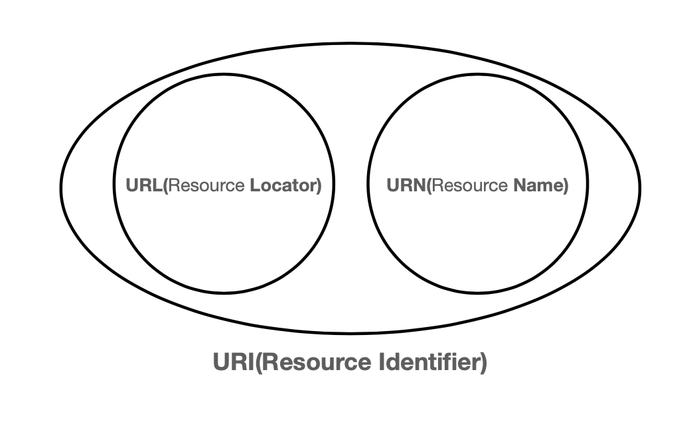
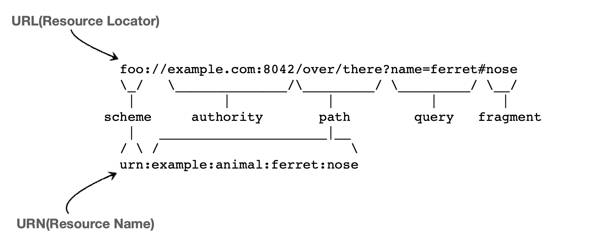

# URI (Uniform Resource Identifier)
> 직역하자면 일정한 규칙 자원 식별자 정도로 해석 된다.

"URI 는 로케이터(Locator), 이름(Name) 또는 둘다 추가로 분류될 수 있다.

이처럼 url은 URL(Locator)과 URN(Name)을 가진 대 분류이다.

위 사진 처럼 URL은 웹브라우져 창에 많이 적는 그거다.  
URN은 그저 이름을 부여 한건데 아무튼 URN은 있다는 것만 기억하는게 나을 것 같다.

## URI 단어 뜻
* Uniform: 리소스 식별하는 통일된 방식
* Resource: 자원, URI로 식별할 수 있는 모든 것
* Identifier: 다른 항목과 구분하는데 필요한 정보

* URL: Uniform Resource Locator
* URN: Uniform Resource Name 

## URL, URN 단어 뜻
* URL - Locator: 리소스가 있는 위치를 지정
* URN - Name: 리소스에 이름을 부여
  * 위치는 변할 수 있지만, 이름은 변하지 않는다.
  * urn:isbn:81300129
  * URN 이름만으로 실제 리소스를 찾을 수 있는 방법이 보편화 되지 않음
* URI를 URL과 같은 의미로 이야기하겠음

## URL - 전체 문법
https://www.the-moment.org/search?key=value

- 프로토콜 (https)
- 호스트명 (www.the-moment.org)
- 포트번호 (443)
- 패스 (/search)
- 쿼리 파라미터(key=value)

### URL - scheme
https://www.the-moment.org/search?key=value

* 주로 프로토콜 사용
* 프로토콜: 어떤 방식으로 자원에 접근할 것인가 하는 약속 규칙
  * ex) http, https, ftp 등
* http는 80포트, https는 443 포트를 주로 사용, 포트는 생략 가능
* https는 http에 보안 추가

### URL - userinfo 
scheme://**[userinfo@]**host[:port][/path][?query][#fragment]

* url에 사용자 정보를 포함해서 인증
* 거의 사용하지 않음

### URL - host
scheme://[userinfo@]**host**[:port][/path][?query][#fragment]

* 호스트명
* 도메인명 또는 IP 주소 직접 사용가능

### URL - PORT
https://www.google.com:443/search?q=hello&hl=ko

* 접속 포트
* 일반적으로 생략, 생략시 http는 80, https는 443

### URL - path
https://www.google.com:443/search?q=hello&hl=ko

* 리소스 경로, 계층적 구조
* ex
  * /home/file1.jpg
  * /members
  * /members/100

### URL - query
https://www.google.com:443/search?q=hello&hl=ko

* key = value
* ? 로 시작, &로 추가 가능. ?keyA=valueA*keyB=valueB
* query parameter, query string 등으로 불림, 웹서버에 제공하는 문자형태

### URL - fragment
https://docs.spring.io/spring-boot/docs/current/reference/html/getting-
started.html#getting-started-introducing-spring-boot

* fragment
* html 내부 북마크 등에 사용
* 서버에 전송하는 정보 아님

### 다음에 계속... 

