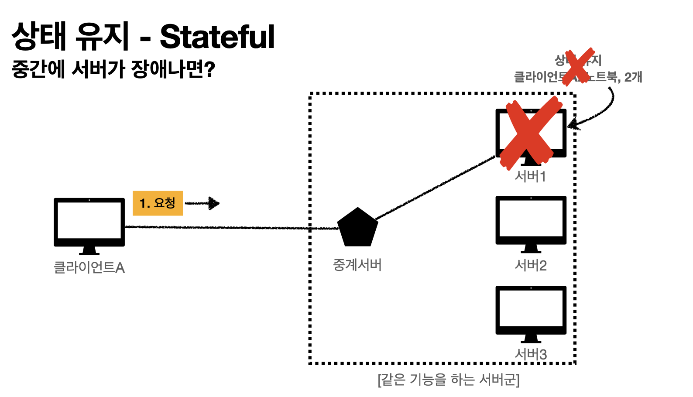
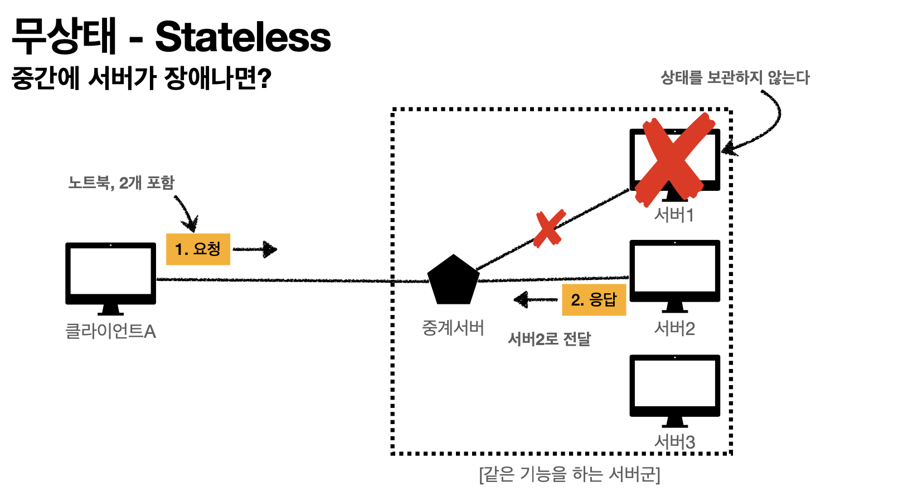

# 모든 것이 HTTP

## 목차
* 모든 것이 HTTP
* 클라이언트 서버 구조
* Stateful, Stateless
* 비 연결성
* HTTP 메시지

## HTTP (HyperText Transfer Protocol)

### 모든 것이 HTTP
> HTTP 메시지에 모든 것을 전송

* HTML, TEXT
* IMAGE, 음성, 영상, 파일
* JSON, XML (API)
* 거의 모든 형태의 데이터를 전송 가능
* 서버간에 데이터를 주고 받을 때도 대부분 HTTP 사용 
  * TCP로 서버간 통신하는건 요즘 거의 없음. (굳이 있다면 게임 서버?)
* 지금은 HTTP 시대!

#### 이건 몰랐지 ?!?!

## HTTP 역사

* HTTP/0.9 1991년: GET 메서드만 지원, HTTP 헤더 X
* HTTP/1.0 1996년: 메서드, 헤더 추가
* HTTP/1.1 1997년: 가장 많이 사용, 우리에게 가장 중요한 버전
  * RFC2068(1997) -> RFC2616(1999) -> RFC7230~7235(2014)
* HTTP/2 2015년: 성능 개선
* HTTP/3 진행중: TCP 대신에 UDP 사용, 성능 개선

## 기반 프로토콜

* TCP: HTTP/1,1, HTTP/2
* UDP: HTTP/3
* 현재 HTTP/1.1 주로 사용
  * HTTP/2, HTTP/3 도 점점 증가

## HTTP 특징

* 클라이언트 서버 구조
* 무상태(Stateless) 프로토콜, 비연결성
* HTTP 메시지
* 단순함, 확장 가능

## 클라이언트 서버 구조

* Request Response 구조
* 클라이언트는 서버에 요청을 보내고 응답을 대기
* 서버가 요청에 대한 결과를 만들어서 응답

## 무상태 Stateless 프로토콜

* 서버가 클라이언트의 상태를 보존 X
* 장점: 서버 확장성 높음(스케일 아웃)
* 단점: 클라이언트가 추가 데이터 전송

## Stateful(상태유지), Stateless(무상태) 차이 정리

### Stateful(상태유지)

* Stateful, 상태유지: 중간에 다른 서버로 바뀌면 안된다.
  * A 서버가 a고객에 대해 차근차근 상태를 저장하고 있는데 갑자기 장애가 생겨서 B서버가 a고객을 담당해야 한다면 고객은 처음부터 상태를 다시 전달해야 한다.

### Stateless(무상태)

* Stateless, 무상태: 중간에 다른 서버로 바뀌어도 상관없다. (서버에서 고객에 대한 상태를 저장하지 않음).
  * A 서버가 a고객에 대해 상태를 저장하지 않음. 그냥 요청에 대한 응답만 함.
  * 고객 증가로 인한 서버 스케일 아웃(수평 확장)에 유리하다.
  * 무한한 서버 증설 가능.

#### Stateless, 무상태 실무 한계

* 모든 것을 무상태로 설계 할 수 있는 경우도 있고 없는 경우도 있다.
* 무상태
  * 로그인이 필요 없는 단순한 서비스 소개 화면
* 상태 유지
  * 로그인
* 로그인한 사용자의 경우 로그인 했다는 상태를 서버에 유지
* 일반적으로 브라우저 쿠키와 서버 세션등을 사용해서 상태 유지
* 상태 유지는 최소한만 사용
