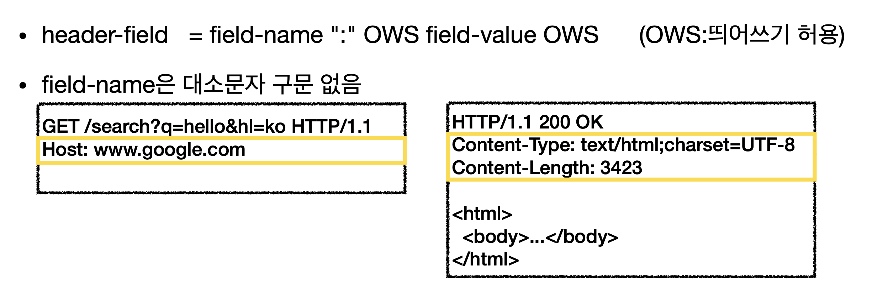
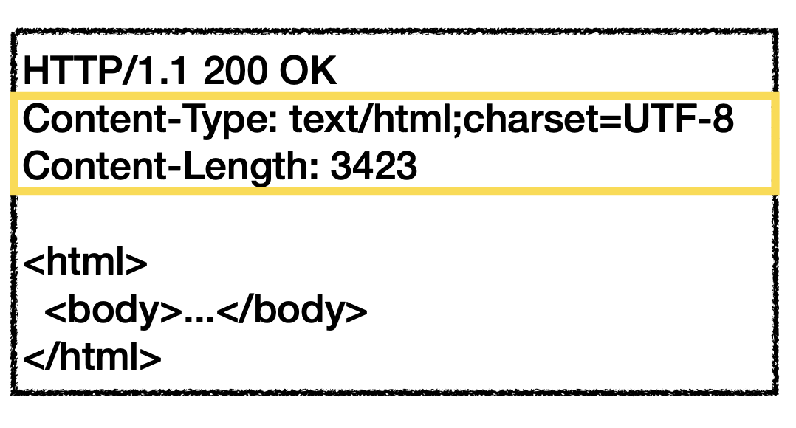
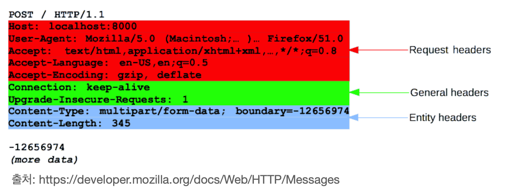
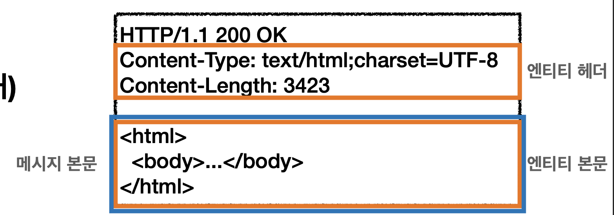

# HTTP 헤더 개요
> HTTP 헤더는 클라이언트와 서버가 요청 또는 응답으로 부가적인 정보를 전송할 수 있도록 해준다.

## HTTP 헤더

## HTTP 헤더의 용도

* HTTP 전송에 필요한 모든 부가정보
* 메시지 바디의 내용, 메시지 바디의 크기, 인증, 요청 클라이언트, 서버 정도 등등
* 표준 헤더가 너무 많음 
* [세부적인 내용은 여기를 참고하세요](https://en.wikipedia.org/wiki/List_of_HTTP_header_fields)

## HTTP - RFC2616 과거

* 헤더 분류
  * General 헤더: 메시지 전체에 적용되는 정보 ex) Connection: close
  * Request 헤더: 요청 정보 ex) User-Agent: Mozilla/5.0 (Macintosh;)
  * Response 헤더: 응답 정보 ex) Server: cloudflare [우하한형제들]
  * Entity 헤더: 엔티티 바디 정보 ex) Content-Type: text/html, Content-Length: 2342

### HTTP BODY

* 메시지 본문은 엔티티 본문을 전달하는데 사용
* 엔티티 본문은 요청이나 응답에서 전달할 실제 데이터
* 엔티티 헤더는 엔티티 본문의 데이터를 해석할 수 있는 정보 제공
  * 데이터 유형 (html, json) 데이터 길이, 압축 정보 등등

### [RFC7230~7235 다음화에 계속..]()