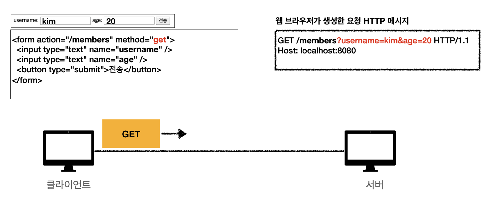

# HTTP 메서드 활용
* 클라이언트에서 서버로 데이터 전송
* HTTP API 설계 예시

## 클라이언트에서 서버로 데이터 전송

### 데이터 전달 방식은 크게 2가지

* 쿼리 파라미터를 통한 데이터 전송
  * GET
  * 주로 정렬 필터(검색어)
* 메시지 바디를 통한 데이터 전송
  * POST, PUT, PATCH 
  * 회원가입, 상품 주문, 리소스 등록, 리소스 변경

### 4가지의 상황
* 정적 데이터 조회
  * 이미지, 정적 텍스트 문서
* 동적 데이터 조회
  * 주로 검색, 게시판 목록에서 정렬 필터(검색어)
* HTML Form 을 통한 데이터 전송
  * 회원가입, 상품주문, 데이터변경
* HTTP API를 통한 상품 데이터 전송
  * 회원가입, 상품주문, 데이터변경
  * 서버to서버, 앱 클라이언트, 웹 클라이언트(Ajax)

## 정적 데이터 조회

- 쿼리 파라미터 미사용

> 이미지, 정적 텍스트 문서  
> 조회는 GET 사용  
> 정적 데이터는 일반적으로 쿼리 파라미터 없이 리소스 경로로 단순하게 조회 가능

## 동적 데이터 조회

- 쿼리 파라미터 사용

> 주로 검색, 게시판 목록에서 정렬 필터  
> 조회 조건을 줄여주는 필터, 조회 결과를 정렬하는 정렬 조건에 주로 사용  
> 조회는 GET 사용  
> GET은 쿼리 파라미터 사용해서 데이터 전달  

## HTML Form 데이터 전송

HTML Form 은 HTTP Method 가 `POST, GET` 만 지원된다.

### POST 전송 - 저장 요청

특이하게 웹 브라우저가 생성한 요청을 보면 마치 GET 욫청의 쿼리 파라미터 처럼 `key=value` 사이에 `&` 기호로 메시지가 본문에서 생성된 것을 볼 수 있다.

### GET 전송 - 조회 요청 

**또한 HTML Form `GET`은 조회에서만 사용해야 한다. 리소스 변경이 발생하는 곳에 사용하면 안된다.**

## 정리

참고하면 좋은 URI 설계 개념

* 문서
  * 단일 개념 (파일 하나, 객체 인스턴스, 데이터베이스 row)
  * ex) `/members/100`, `/files/{filename}`
* 컬렉션
  * 서버가 관리하는 리소스 데릭터리
  * 서버가 리소스의 URI를 생성하고 관리
  * ex) `/members`
* 스토어
  * 클라이언트가 관리하는 자원 저장소
  * 클라이언트가 리소스 URI를 알고 관리
  * ex) `files`
* 컨트롤러, 컨트롤 URI
  * 문서, 컬렉션, 스토어로 해결하기 어려운 프로세스를 실행
  * 동사를 직접 사용
  * ex) `/members/{id}/delete`