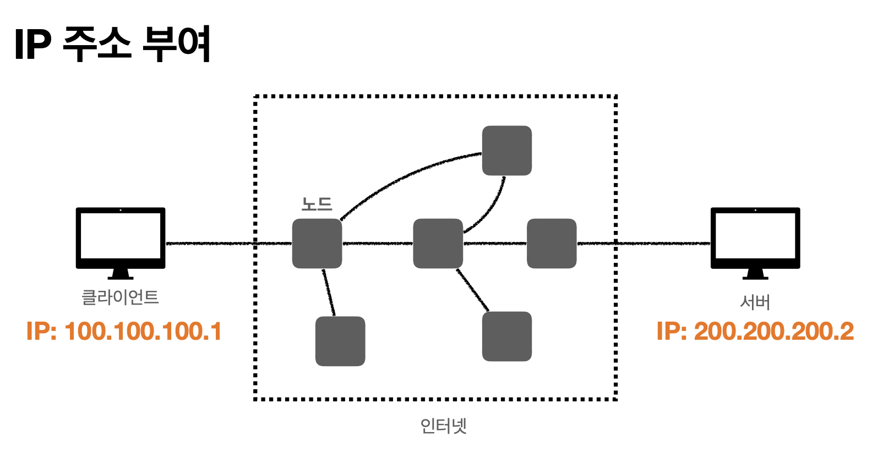
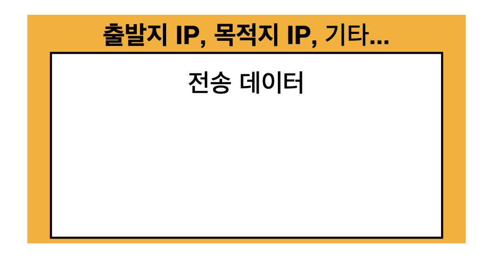
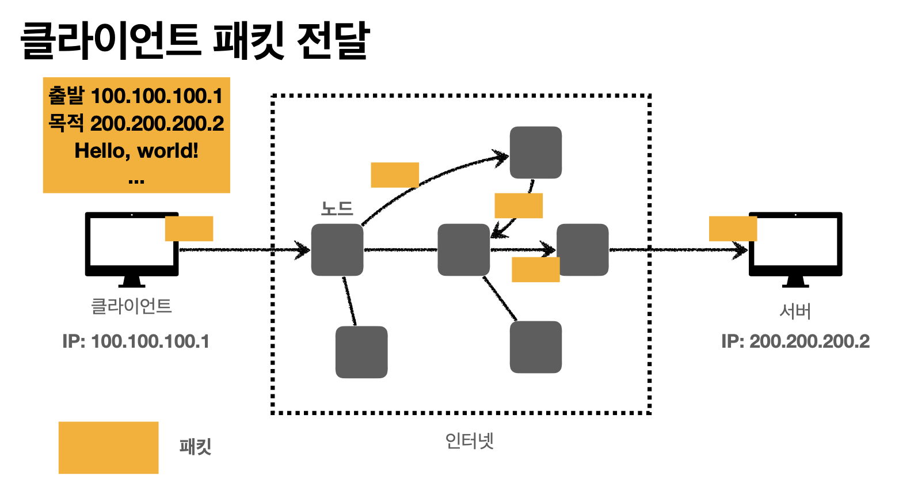
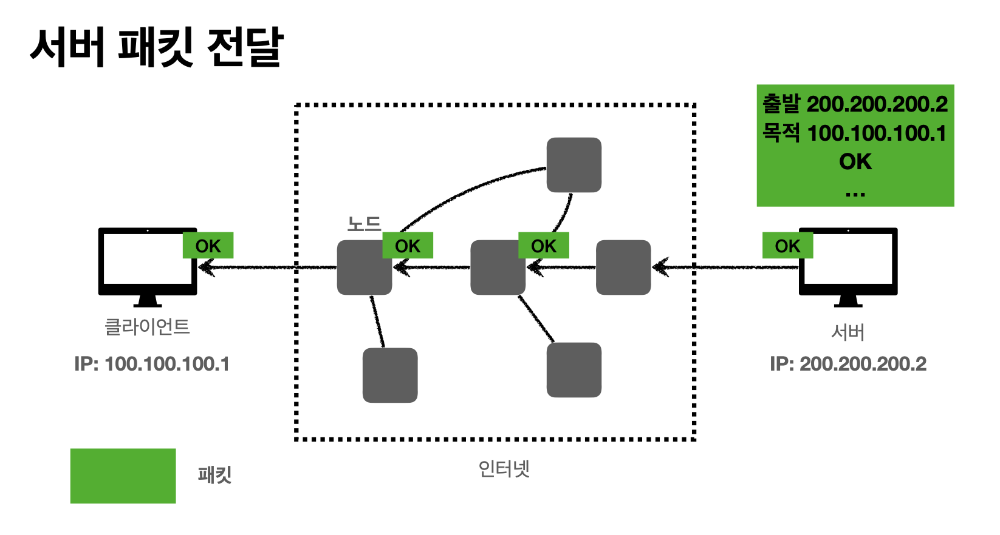

# IP(인터넷 프로토콜)

위에 이미지 처럼 클라이언트와 서버는 고유한 ip 주소를 가지고 있다.  
만약 클라이언트(100.100.100.1)에서 서버(200.200.200.2)로 어떠한 요청을 보내고자 할 때. IP(인터넷 프로토콜)에서는 패킷(Packet)이라는 통신 단위로 전달한다.

패킷(Packet)은 아래 그림과 같이 구성되어 있다.

## 클라이언트의 패킷 전달
> 앞서 말했던 가설, 클라이언트가 서버에 패킷을 보낼 때 어떻게 전달 될까?

위에 그림처럼 수많은 노드를 걸쳐 전달되게 된다.  

만약, 패킷에 실어 보낼 전송 데이터가 크다면 어떻게 처리할까?  
패킷을 여러개로 나눠 전달한다. <u> 나중에 언급하겠지만, </u> 이 부분에서 IP통신의 단점이 발생한다.

## 서버의 패킷 전달
> 클라이언트가 서버에게 패킷을 보냈다면 응답을 해야겠죠? 여기서 서버는 어떻게 응답하냐면요.. 

방법은 클라이언트와 다를 바 없다.  
**하지만, 서버의 응답 패킷 전달과정의 노드 경로와 클라이언트의 요청 패킷 전달 노드의 경로와 같지 않음을 알고 있자.**

## IP 프로토콜의 한계
* 비연결성
  * 패킷을 받을 대상이 없거나 불능(전원이 꺼져 있다 등) 상태여도 패킷을 전송한다.
* 비신뢰성
  * 중간에 패킷이 사라지면?? (응 패킷이 소실될 수 있다.)
    * 인터넷 망 노드의 문제가 생겨서 중간의 패킷 소실의 위험이 있다.
  * 패킷이 순서대로 안오면?? (응 순서대로 간다는 보장이 없다.)
    * 앞서 언급했듯 패킷에 담을 정보의 용량이 크면 패킷을 적절하게 나누어 전달하는 특징이 있는데, 내가 A 보내고 B 보낸다고 해서 목적지에 A 다음 B가 전달 된다는 보장이 없다는 것이다.
* 프로그램 구분
  * 같은 IP를 사용하는 서버에서 통신하는 애플리케이션이 둘 이상이면?

### 다음편에서 계속.. 