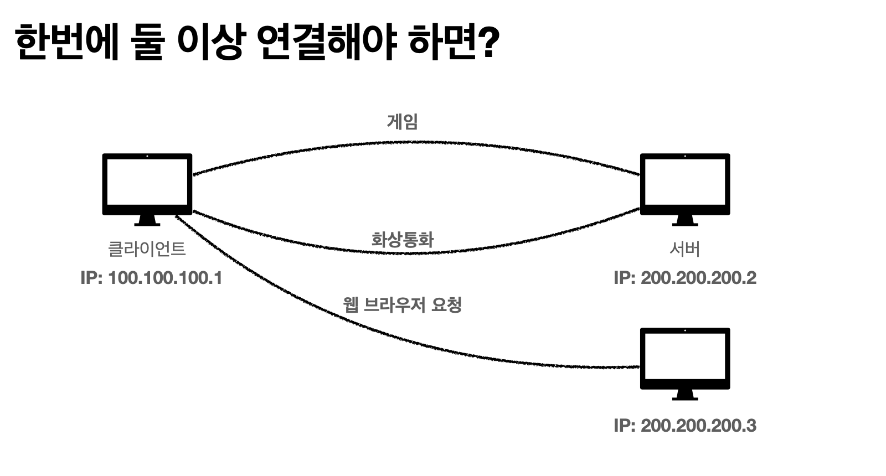
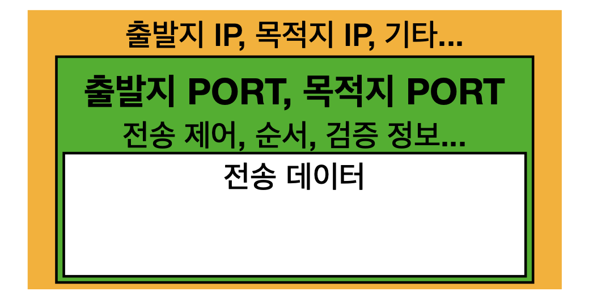

# PORT - 포트
> 포트는 개발하면서 많이 보았을 것이다.

## 들어가기

이렇게 한번에 둘 이상을 연결해야 할 때 포트를 써야 한다.  
앞서 [TCP&UDP](./TCP-UDP.md) 편에서도 언급했지만, TCP/IP 패킷은 아래와 같이 이루어져 있는데..

이렇게 ip + `출발지 포트`와 `목적지 포트` 정보를 실어 요청하면,  
브라우저 같은 경우에는 요청에 대해 결과 값을 만들어 요청한 ip의 `출발지 포트`에 정확하게 꽂아주게 된다.

IP는 아파트 (동) 이라고 하면 PORT는 아파트 (호) 라고 생각하면 쉽다.

## PORT
* 0~65535: 할당 가능한 영역
* 0~1023: 잘 알려진 포트, 사용하지 않는 것이 좋다
  * 20, 21: FTP
  * 23: TELNET
  * 80: HTTP
  * 443: HTTPS

### 다음편에서 계속..