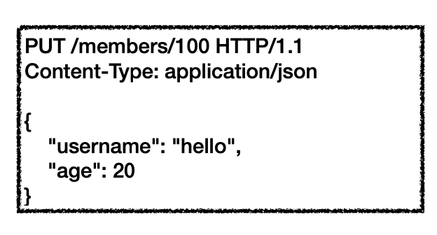
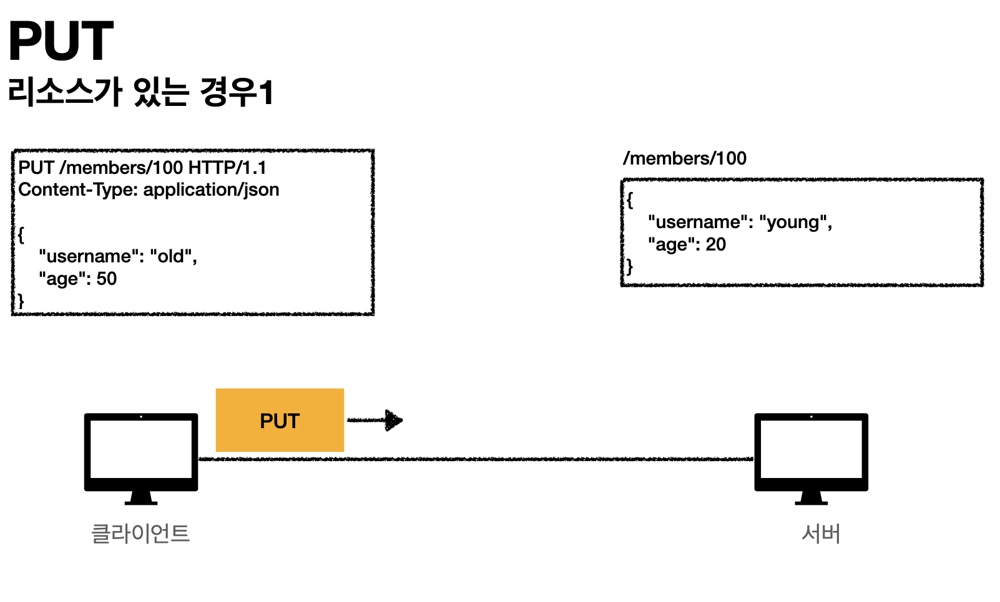
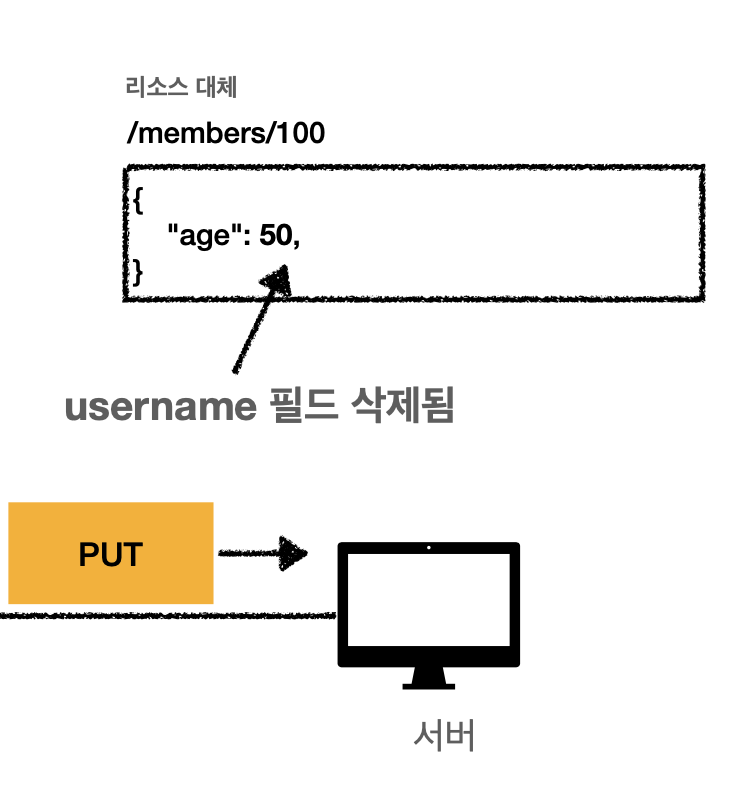
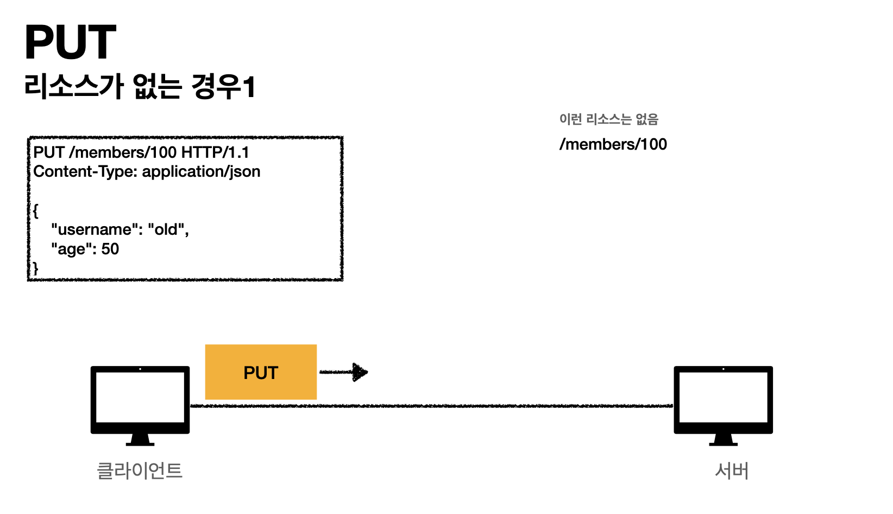
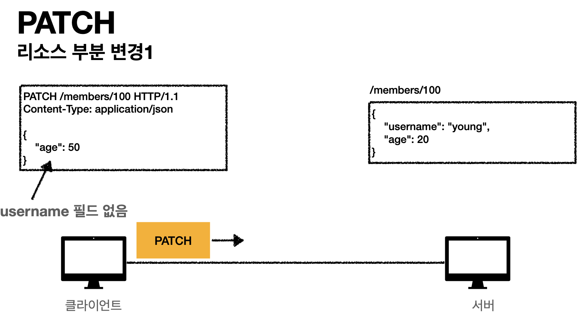
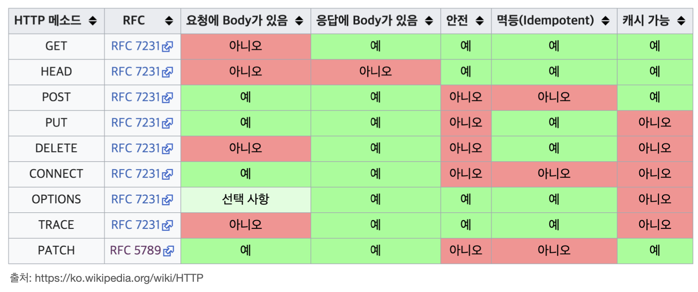

# HTTP 메서드 - PUT, PATCH, DELETE

## PUT

* 리소스를 대체
  * 리소스가 있으면 대체
  * 리소스가 없으면 생성
  * 쉽게 이야기해서 "덮어쓰기"
* 중요! 클라이언트가 리소스를 식별
  * 클라이언트가 리소스 위치(ex. member_id)를 알고 지정
  * POST 와 차이점

### PUT 리소스가 있는 경우 (덮어쓰기)

> 만약 PUT 요청(`member/100`) json에 username 필드는 없고  `{"age":50}` 로만 돼 있을 때.. **굉장히 주의하자**

PUT 요청 처리 시 username의 필드가 삭제되고 그대로 **리소스가 완전히 대체된다**

### PUT 리소스가 없는 경우

뭐 이처럼 그냥 신규 리소스가 생성 되는 것이다.

## PATCH
> 리소스 부분 변경

PATCH 요청 json에 존재하는 `"필드":데이터` 만 리소스에서 **"부분 변경"**이 일어난다.

## DELETE 
[DELETE] `/member/100` 이렇게 요청하면 index 100에 해당하는 리소스가 삭제된다. (너무 쉬우니 넘어감)

## HTTP 메서드의 속성
* 안전 (Safe Methods)
* 멱등 (Idempotent Methods)
* 캐시가능 (Cacheable Methods)

전 포스팅에서도 언급했지만, 현재는 GET 메서드에서도 요청에 Body를 포함할 수 있다.  
하지만 아직 지원하지 않는 서버도 많고, 실무에서는 **절대 권장하지 않는다.**

### 안전 - safe

* 호출해도 리소스를 변경하지 않는다.
  * Q: 그래도 계속 호출해서, 로그 같은게 쌓여 장애가 발생하면요?
  * A: 안전은 해당 리소스만 고려한다. 그런 부분까지 고려하지 않는다.

### 멱등 - Idempotent

#### 멱등의 예

* f(f(x)) = f(x)
* 한 번 호출하든 두 번 호출하든 100번 호출하든 결과는 같다.
* 멱등 메서드
  * GET: 한 번 조회하든, 두 번 조회하든 결과는 같다.
  * PUT: 결과를 대체한다. 따라서 같은 요청을 여러번 해도 결과는 같다.
  * DELETE: 결과를 삭제한다. 같은 요청을 여려번 해도 결과는 같다.

* POST: 멱등이 아니다. 두 번 호출하면 같은 결제가 중복해서 발생할 수 있다.

#### 멱등의 활용

* 자동 복구 메커니즘
* 서버가 TIMEOUT 등으로 정상 응답을 못주었을 때, 클라이언트가 같은 요청을 다시 해도 되는가? 판단 근거.

### 캐시가능

* 응답 결과 리소스를 캐시해서 사용해도 되는가
* GET, HEAD, POST, PATCH 캐시가능
* 실제로는 GET, HEAD 정도만 캐시로 사용
  * POST, PATCH는 본문 내용까지 캐시 키로 고려해야 하는데 구현이 쉽지 않음.
