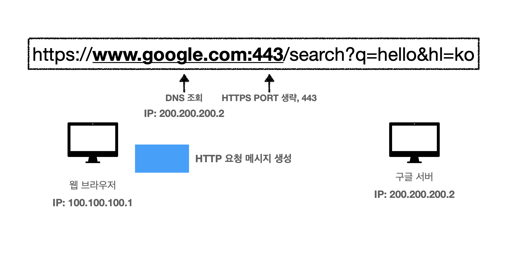
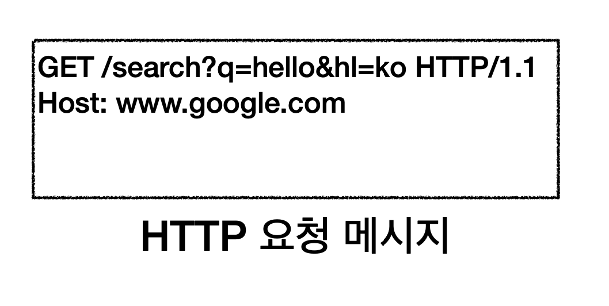
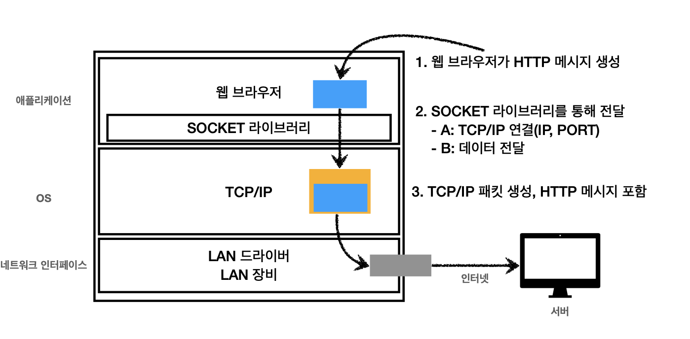
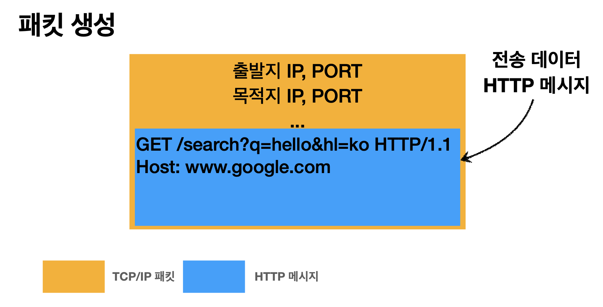
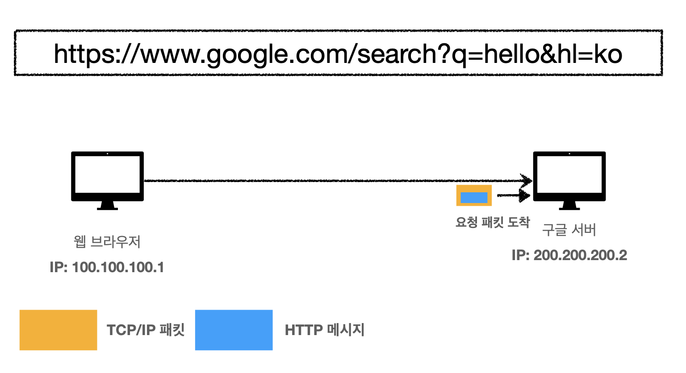
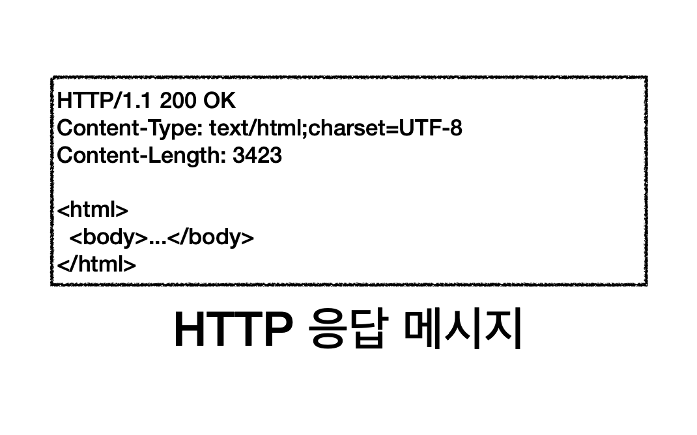

# 웹 브라우저 요청 흐름
> 웹 브라우저 요청 흐름을 이해시키기 위해 앞전에 인터넷 네트워크에 대해 정리했던 것이다.

## 들어가기

### 아래와 같이 내가 원하는 url 을 웹 브라우저에 입력하면...

1. 우선 DNS를 조회와 동시에 생략된 포트를 알아챈다.
2. 이 때 HTTP 요청 메시지가 생성된다 

대략 생성된 HTTP 메시지는 아래와 같다.

### 이렇게 생성된 HTTP 메시지는 구글 서버에 어떻게 전달 될까?

위에 사진은 [TCP-UDP](./TCP-UDP.md) 개념에 나왔던 것과 같죠?  
웹 브라우져 요청 흐름을 설명하기 위해 앞전에 인터넷 네트워크에 대해 설명했었습니다.  

1. client 브라우져에서 생성된 HTTP 메시지를
2. 소켓 라이브러리를 통해 TCP/IP 연결을 하고 (IP, PORT) 데이터를 전달한다.
3. TCP/IP 딴에서 HTTP 메시지를 포함한 패킷을 생성하여 인테넷 망으로 던진다.

TCP/IP에서 생성된 HTTP 메시지를 포함한 패킷은 이처럼 생겼다.

### 전달하기

구글 서버에 안전하게 전달됐다.  
안전하게!! 안전하게 전달 되지 않았다면 그 또한 클라이언트는 알 수 있을 것이다.  
이유는 !! TCP/IP 통신을 했기 떄문이다! 잊지 않았죠?

### 응답하기
**HTTP 요청 메시지**를 포함한 패킷을 받은 구글 서버는 그에 맞는 **HTTP 응답 메시지**를 생성한다.

HTTP 응답 패킷을 요청 패킷 정보(출발지 IP, PORT)를 통해 전달하게 된다.

그 응답 패킷을 클라이언트의 웹 브라우져를 통해 렌더링 하게 되고, 곧 클라이언트 화면에 결과가 깔끔하게 노출되게 된다.