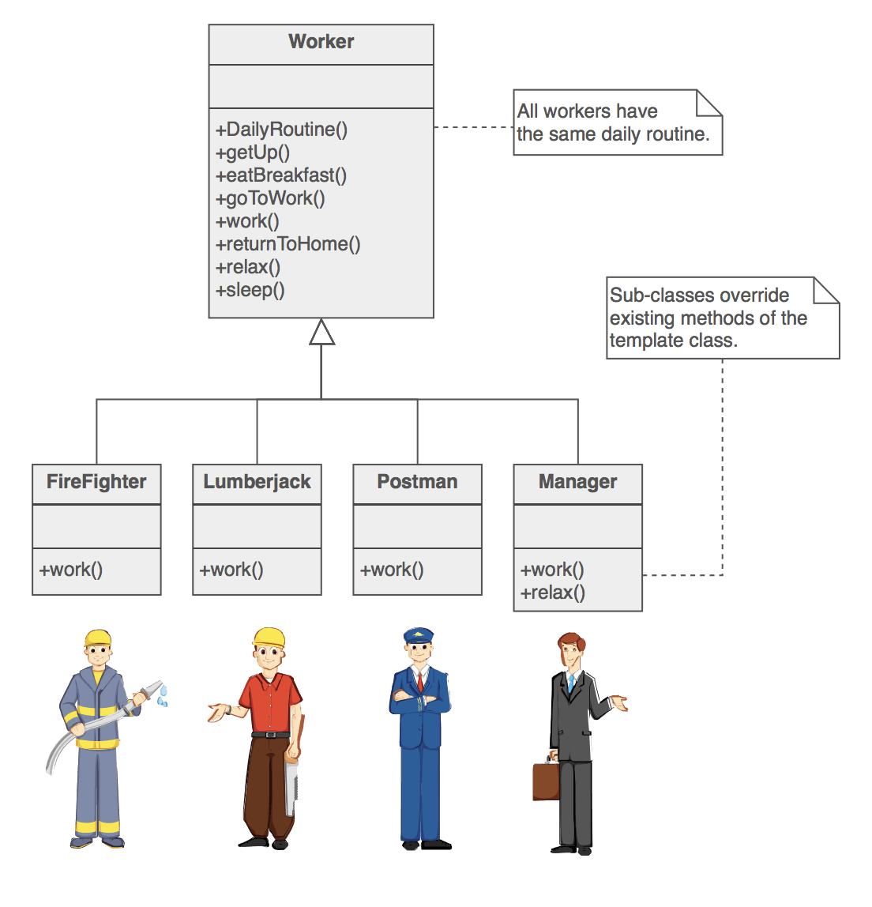

## 템플릿 메서드 패턴
> DispatcherServlet에서 사용된 디자인 패턴 중 하나인 Template method Pattern에 대해서 알아보도록 하겠습니다.

서로 다른 유사한 컴포넌트가 있을때, 공통 인터페이스나 구현을 재사용하지 않을 수 있습니다.  
**구성요소의 대부분을 동일하게 가져가지만 일부만 다르게 가져갈때 중복을 최소화 하기위해서** 우리는 ``template method pattern``을 사용합니다.



위와 같은 로직의 Flow가 진행이 된다고 했을때..  
각 직업 마다의 일이 다르기 때문에 일부를 다르게 변경해줘야 한다.

> 이경우 work, relax등 일부만 다를 수 있습니다.   
> 이런경우 구현되어 있는 일부 method만 subClass에서 실행할 수 있다면 완벽해지겠구나라는 것을 알 수 있습니다.  
> 이때 사용할 수 있는 Design Pattern이 Template Method Pattern입니다.  
> 구조는 아래와 같이 됩니다. 그러면 한번 예제를 만들어 보도록 하겠습니다.

1. Worker.class
```java
public abstract class Worker {

    public void DailyRoutine()
    {
        getUp();
        eatBreakfast();
        goToWork();
        work();
        returnToHome();
        relax();
        sleep();
    }

    private void getUp()
    {
        System.out.println("getUp!");
    }

    private void eatBreakfast()
    {
        System.out.println("getBreakfast");
    }

    private void goToWork()
    {
        System.out.println("goToWork");
    }

    // 추상메서드와 오버리이딩이 가능한 protected 메서드 사용으로 만든다.
    protected abstract void work();

    private void returnToHome()
    {
        System.out.println("returnToHome");
    }

    // 추상메서드와 오버리이딩이 가능한 protected 메서드 사용으로 만든다.
    protected abstract void relax();

    private void sleep()
    {
        System.out.println("sleep");
    }
}
```
2. 필요에 맞게 구현하기.

```java
public class FireFighter extends Worker{

    @Override
    protected void work() {
        System.out.println("FireFighter`s work");
    }

    @Override
    protected void relax() {
        System.out.println("FireFighter`s relax");
    }
}
```